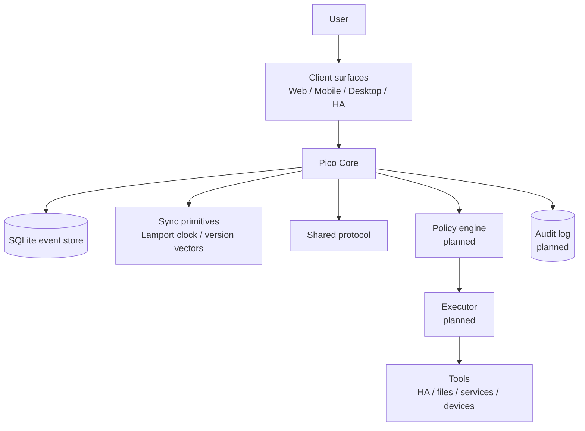
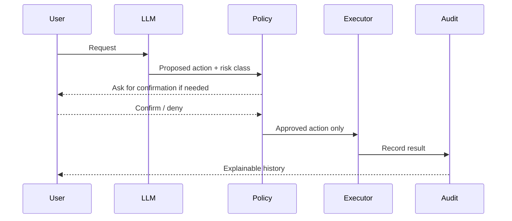
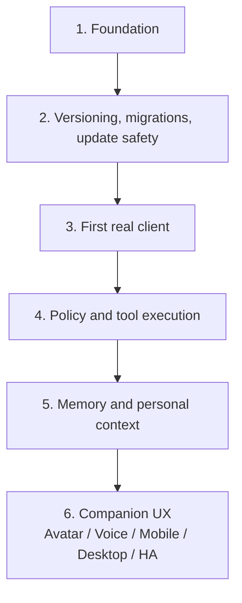

# Pico


Pico is a local-first personal AI companion foundation.

The project starts deliberately small: a tested core service, a shared protocol, sync primitives, a release pipeline, and a Home Assistant add-on path. The long-term goal is a personal assistant that can run across trusted devices, understand context, interact through text/voice/avatar surfaces, and execute tools only through explicit policy and audit boundaries.

## Visual identity

Pico's design basis is a small floating digital companion: rounded body, glossy light shell, black face display, expressive glowing eyes, antenna identity light, and a bright chest core.


The avatar is not just decoration. It communicates state, context, risk, and activity:

| Color | Meaning |
|---|---|
| Blue / cyan | normal, active, available |
| Violet | thinking, analysing, AI reasoning |
| Yellow / amber | warning, uncertainty, confirmation needed |
| Red | blocked, critical, policy stop |
| Green | success, safe completion, positive result |

The richer concept board from the design discussion is documented in `docs/architecture/0013-visual-design-language.md`. Product icons use a simplified neutral Pico silhouette, while larger UI/README/landing-page assets may use the richer companion scene with panels and context cards.

## Project intent

Pico is not meant to become an uncontrolled chatbot with system access.

The core design rule is:

> The LLM may think and suggest. The policy engine decides. The executor acts. The user confirms risk. The audit log records what happened.

This keeps the companion user experience separate from the authority model.

## Current status

Foundation phase.

Implemented or prepared:

- TypeScript monorepo
- Fastify-based Pico Core
- SQLite-backed append-only event store
- Lamport clock and version-vector helpers
- shared protocol package for events, avatar state, and tool payloads
- WebSocket endpoint for event streaming
- CI release gates
- Docker image build
- multi-arch GHCR publishing path
- Home Assistant add-on metadata
- architecture notes under `docs/architecture`

Not production-ready yet:

- authentication and authorization
- policy engine implementation
- tool executor implementation
- encrypted personal data domains
- migration/rollback system
- real companion UI
- voice/avatar runtime

## Architecture overview



## Authority model



## Release and update flow


Release rule:

> No green pipeline, no release.

Version bump locations and the release checklist are documented in `docs/release/versioning.md`.

## Repository structure

```text
.
├── apps
│   ├── core              # Fastify backend service
│   ├── web               # first web client placeholder
│   └── ha-addon          # historical/internal add-on draft
├── docker
│   └── core.Dockerfile   # Pico Core container image
├── docs
│   ├── architecture      # architecture decision notes and concept docs
│   ├── assets            # README/project assets
│   └── release           # release and versioning notes
├── packages
│   ├── protocol          # shared event and payload types
│   └── sync              # Lamport clock and version-vector helpers
├── pico_core             # Home Assistant add-on metadata
├── repository.yaml       # Home Assistant add-on repository metadata
└── .github/workflows     # CI pipeline
```

## Home Assistant add-on

Pico currently ships a foundation add-on definition under:

```text
pico_core/
```

The add-on uses the prebuilt container image:

```text
ghcr.io/riederch/pico/core
```

Current tag:

```text
0.1.1
```

The add-on exposes Pico Core on port `3100` and defines a watchdog against:

```text
/health
```

Current add-on icon assets:

```text
pico_core/icon.svg
pico_core/icon.png
```


The icon follows the simplified neutral Pico silhouette: dark rounded background, white companion shell, cyan eyes, antenna light, and chest core.

## Local development

Install dependencies:

```bash
pnpm install
```

Run the full release verification locally:

```bash
pnpm release:verify
```

Start Pico Core:

```bash
pnpm dev:core
```

Health check:

```bash
curl http://localhost:3100/health
```

Create a test event:

```bash
curl -X POST http://localhost:3100/api/events \
  -H 'content-type: application/json' \
  -d '{"deviceId":"desktop-dev","type":"message.created","payload":{"role":"user","text":"Hallo Pico"}}'
```

List events:

```bash
curl http://localhost:3100/api/events
```

## Current API surface

| Endpoint | Purpose |
|---|---|
| `GET /health` | service health check |
| `GET /api/events` | list stored events |
| `POST /api/events` | append an event |
| `WS /ws` | event stream endpoint |

## Binary asset workflow

Large or binary files such as PNG design assets are not edited directly through the GitHub text-file connector. When such files are needed, they are prepared as a ZIP archive with the correct repository folder structure. The ZIP can be extracted in the repository root and committed locally.

Expected image asset paths:

```text
docs/assets/pico-design-concept.png
docs/assets/pico-ha-icon.png
docs/assets/pico-readme-hero.png
pico_core/icon.png
```

## Concept documents

The project concept is persisted as architecture notes:

| Document | Topic |
|---|---|
| `0001-foundation.md` | foundation architecture |
| `0002-peer-trust-and-relationships.md` | trust relationships between Pico instances |
| `0003-family-server-and-user-sovereignty.md` | shared server without loss of user sovereignty |
| `0004-parent-child-relationship.md` | guardian/child model |
| `0005-release-and-update-platform.md` | repo, release, and update model |
| `0006-testing-and-release-gates.md` | tests as release blockers |
| `0007-home-assistant-add-on-release.md` | HA add-on update path |
| `0008-product-vision-and-persona.md` | product vision and Pico persona |
| `0009-avatar-and-interaction-model.md` | avatar, voice, and interaction boundaries |
| `0010-tool-policy-and-executor-model.md` | tool policy, executor, and risk classes |
| `0011-privacy-security-and-audit-model.md` | privacy, security, and audit principles |
| `0012-roadmap-foundation-to-companion.md` | roadmap from foundation to companion |
| `0013-visual-design-language.md` | visual identity, avatar states, status colors, and context modes |

## Roadmap



## Design principles

- Local-first where practical
- User sovereignty over identity and personal data
- Explicit privacy domains
- No unrestricted shell for the LLM
- Policy-gated tool execution
- Confirmation for risky actions
- Append-only event and audit thinking
- Tests block releases
- Updates must become reversible before real data matters
- Friendly visual companion layer, strict execution layer

## Next implementation steps

- Add `GET /api/system/version`
- Add migration tracking
- Add backup-before-migration concept and tests
- Validate the Home Assistant add-on on a real HA installation
- Build the first real web client connected to `/ws`
- Add the first policy-gated read-only tool
