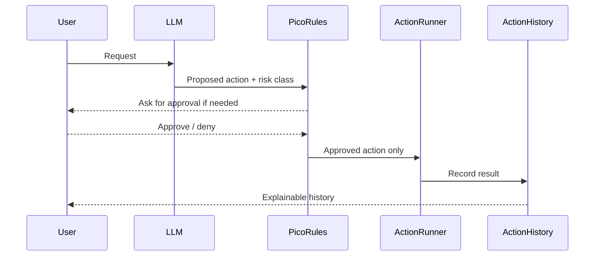
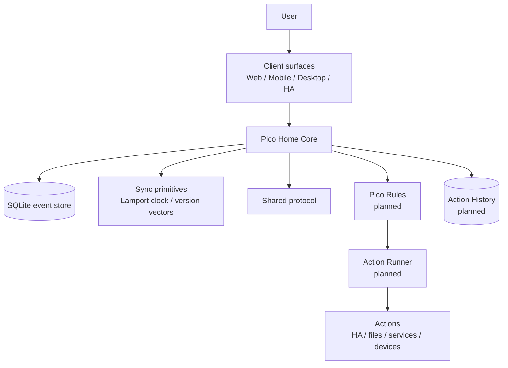
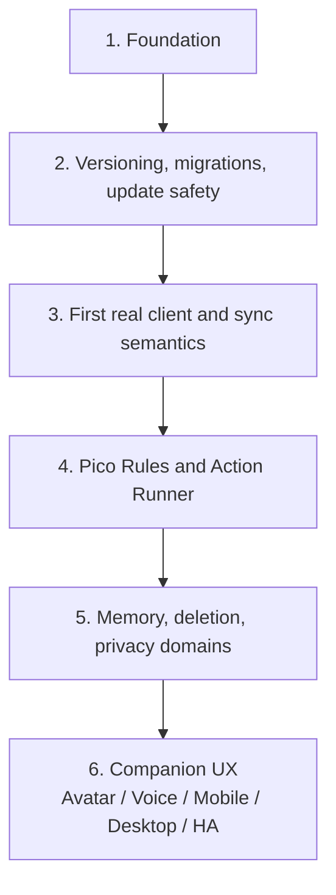

# Pico Technical README


This file is the technical companion to `README.md`.

`README.md` is the non-technical project introduction. `ReadmeTech.md` must always contain all information from `README.md`, plus the technical details needed for contributors, reviewers, operators, and future architecture work.

## Public summary

Pico is a local-first personal AI companion foundation.

The goal is not simply to build another chatbot. Pico is meant to become a sovereign personal agent substrate: an assistant foundation that can run across trusted devices, understand context, interact through text, voice, avatar, and Home Assistant surfaces, and execute approved actions only through clear Pico Rules, Action Runner and Action History boundaries.

Pico starts deliberately small. The current repository focuses on the foundation: a tested core service, a shared protocol package, sync primitives, a release pipeline, a foundation dashboard and a Home Assistant add-on path.

Home Assistant is the first packaging and runtime path, not the only intended platform and not an ownership layer for resident Pico identities or private data.

## License and commercial use

Pico is source-available for private and non-commercial use under the PolyForm Noncommercial License 1.0.0.

Private Pico use, private Pico Home use and private Pico WG use are permitted, including family, household, private shared-home and private non-commercial friend-group use.

Commercial use requires prior written permission from the designated Pico rights holder. This includes paid hosting, managed Pico Home services, Pico Home rental, SaaS operation, paid support, business-internal use and integration into commercial products or services.

Current commercial permission contact:

```text
https://github.com/riederch
```

See:

- `LICENSE`
- `NOTICE`
- `COMMERCIAL.md`
- `LICENSE-FAQ.md`
- `TRADEMARK.md`
- `CONTRIBUTING.md`

## Why Pico exists

Most assistant and smart-home systems are controlled by one account, one cloud, or one technical owner. That is convenient, but it can become a control problem in families, partnerships, shared homes, or organisations.

Pico is designed around a different premise:

> Personal AI should help people without taking away their sovereignty.

This means Pico treats identity, ownership, privacy, relationship boundaries, exit rights, and auditability as product features, not as afterthoughts.

## What Pico should become

Pico should eventually be able to:

- run locally where practical
- run Pico Home on multiple host platforms, with Home Assistant as the first packaging path
- sync between trusted Pico Vaults
- support Pico Surfaces such as watches or small displays
- work with Home Assistant and other local tools
- remember useful personal context safely
- share presence, activity, location and emergency context only under clear rules
- support Shared Plans, reminders and cooperative nudging
- adapt its tone to the user while preserving user control
- explain and audit what it did
- ask for approval before risky actions
- keep companion UX separate from execution authority

## What Pico is not

Pico is not intended to become:

- an uncontrolled chatbot with system access
- a cloud-only personal data silo
- a background automation layer without clear approval
- a hidden surveillance or control tool
- a global human scoring or reputation system
- a replacement for explicit user approval
- an owner of every resident Pico identity just because it hosts the service
- a project that invents its own cryptography

## Core authority model

Pico separates suggestion, decision, execution, and audit:

> Pico may suggest. Pico Rules decide. The Action Runner acts only after approval. Action History records what happened.

Technically, the intended model is:



## Visual identity

Pico's design basis is a small floating digital companion: rounded body, glossy light shell, black face display, expressive glowing eyes, antenna identity light, and a bright chest core.


The avatar communicates state, context, risk and activity:

| Color | Meaning |
|---|---|
| Blue / cyan | normal, active, available |
| Violet | thinking, analysing, AI reasoning |
| Yellow / amber | warning, uncertainty, approval needed |
| Red | blocked, critical, policy stop |
| Green | success, safe completion, positive result |

The full visual design language is documented in `docs/architecture/0013-visual-design-language.md`.

## Current status

Pico is in the foundation phase.

Current version:

```text
0.1.7
```

Implemented or prepared:

- TypeScript monorepo
- Fastify-based Pico Home Core foundation service
- SQLite-backed append-only event store
- Lamport clock and version-vector helpers
- migration runner and backup-before-migration contract
- shared protocol package for events, avatar state, action terminology and compatibility aliases
- WebSocket endpoint for event streaming
- foundation diagnostics dashboard
- CI release gates
- Docker image build
- multi-arch GHCR publishing path
- Home Assistant add-on metadata
- architecture notes under `docs/architecture`
- protocol notes under `docs/protocol`
- license, commercial-use, trademark and contribution governance files

Not production-ready yet:

- authentication and authorization
- Pico Rules implementation
- Action Runner implementation
- encrypted personal data domains
- production migration and rollback orchestration
- real companion UI
- voice/avatar runtime
- multi-resident Pico Home tenancy implementation
- inter-Pico and Pico Home protocol conformance tests

## Architecture overview



## Pico Vaults, Pico Surfaces, Pico Relays and Pico Homes

Pico distinguishes three node roles:

| Node type | Role | Data holding | Connectivity |
|---|---|---|---|
| Pico Vault | full Pico node | full knowledge, local database, sync state, backups where configured | direct, LAN, internet, relay |
| Pico Surface | interaction surface | minimal cache/session state only | requires Pico Vault, directly or via relay |
| Pico Relay | transport helper | no authority, no Pico memory ownership | forwards encrypted traffic |

Pico also distinguishes these node roles from a Pico Home:

| Host type | Role | Authority boundary |
|---|---|---|
| Pico Home | runtime and storage host for Pico Home Core | hosts infrastructure; does not automatically own resident Pico identities, private keys or personal domains |
| Empty Pico Home | freshly installed Pico Home | no resident Pico and no Home Host Pico yet |
| Claimed Pico Home | Pico Home claimed by a Home Host Pico | Home Host Pico can manage residency and future access, not resident private data |

Design rules:

> Pico Vaults own knowledge and backups. Pico Surfaces present and capture interaction. Pico Relays transport encrypted messages but do not own Pico identity, memory, or authority.

> A Pico Home provides infrastructure. Hosting is not ownership.

A freshly installed Pico Home starts empty. A one-time Move-In Code lets the first Pico claim the host. That first Pico becomes the Home Host Pico for this Pico Home. The Home Host Pico may invite additional Home Member Picos and may remove them from future use of this host, but it must not decrypt, impersonate, rewrite or own Home Member Picos.

Details are documented in `docs/architecture/0015-full-clients-light-clients-and-relay.md` and `docs/architecture/0024-server-bootstrap-tenancy-and-eviction.md`.

## Scope discipline

Pico deliberately avoids opening all hard problems at once.

The most dangerous areas are treated as explicit architecture constraints:

- cryptography must use reviewed standards or primitives, not custom protocols
- deleteable memory must not be embedded directly into immutable replicated events
- Pico Homes provide infrastructure, not ownership over resident Pico private domains
- Lamport clocks provide ordering, not merge semantics
- Pico Surfaces are interaction surfaces, not knowledge owners
- companion UX must not outrun Pico Rules, Action History, update safety, and deletion semantics
- Context Signals must never become global person scores or safety guarantees
- compatibility claims must not be treated as commercial hosting permission

## Deletability and append-only events

Pico uses an append-only event log as a foundation for sync, auditability, replay and debugging.

That conflicts with future deleteable personal memory if sensitive data is stored directly inside immutable replicated events.

Therefore the design direction is:

> Append-only events record history. Sensitive memory lives behind references, privacy domains, retention policy and encryption boundaries.

Sensitive or deleteable payloads should be referenced from events wherever practical instead of embedded directly in the event log.

Details are documented in `docs/architecture/0014-deletability-and-append-only-events.md`.

## Cryptography boundaries

Pico may define sovereignty boundaries, trust relationships, identity concepts, payload domains and threat models.

Pico must not invent cryptography.

The project will not build custom:

- group encryption protocols
- key agreement protocols
- signature algorithms
- password-based encryption schemes
- recovery cryptography
- MLS-like group state machines

Future encryption work should evaluate established building blocks such as MLS, libsodium, age-style backup encryption, platform keystores, passkeys or hardware-backed identity where appropriate.

Details are documented in `docs/architecture/0016-cryptography-boundaries-and-non-goals.md`.

## Contextual interaction safety and Context Signals

Pico may help users reason about the safety of concrete person-to-person interactions, but it must not become a global reputation system.

Design rule:

> Evaluate the action, not the human as a whole. Evaluate the context, not the reputation. Use Context Signals as evidence-labelled hints, never as a free pass.

A remote Pico cannot prove that its owner is trustworthy. It can only provide limited claims, commitments, attestations or evidence references. The receiving Pico must decide locally, conservatively and in context.

Details are documented in `docs/architecture/0017-contextual-interaction-safety-and-trust-signals.md`.

## Presence, context and location sharing

Pico may support sharing presence, activity, ETA, status, approximate location, exact location, live location, emergency state and similar context between trusted Picos.

This must be consent-based, scoped, visible, revocable, purpose-bound and as imprecise as possible.

Design rule:

> Pico should share context to support care, coordination and safety — not surveillance, coercion or control.

Details are documented in `docs/architecture/0018-presence-context-and-location-sharing.md`.

## Home Assistant threat model

Home Assistant is Pico's first packaging and runtime path. It is useful because it already connects local devices, sensors, scenes and household routines.

That also makes it risky. A Pico add-on can become a powerful local control surface if it gains access to Home Assistant entities or tokens later.

Design rule:

> Home Assistant can be a Pico runtime and tool source, but it must not bypass Pico's policy, consent and audit model.

Details are documented in `docs/architecture/0019-home-assistant-threat-model.md`.

## Contextual service and emergency access

Pico may disclose private service, infrastructure, access or emergency context only when role, context, purpose and necessity justify it.

Design rule:

> Role + context + purpose + necessity + minimal data + expiry + audit.

Pico must not expose the home, body, memory or personal life as a searchable private database.

Details are documented in `docs/architecture/0020-contextual-service-and-emergency-access.md`.

## Private behaviour, legal risk and harm

Pico must distinguish legal risk, moral harm, personal autonomy and interpersonal trust.

Design rule:

> Pico assists. Pico does not police.

Pico should be liberal in private life, strict where real harm, coercion, exploitation, duty risk or danger to others begins.

Details are documented in `docs/architecture/0021-private-behaviour-legal-risk-and-harm.md`.

## Shared Plans and cooperative nudging

Pico may support Shared Plans such as appointments, reservations, shared chores, project steps, service tasks, care responsibilities and duty tasks.

Design rule:

> Loose plans get gentle reminders. Binding plans require approval. Unpleasant duties get small next steps. Critical tasks may escalate. People are not scored; commitments are managed.

Details are documented in `docs/architecture/0022-shared-commitments-and-cooperative-nudging.md`.

## Adaptive tone, motivation and self-binding

Pico may adapt tone, directness, humour and motivational pressure to the user's preferences and observed effectiveness.

Design rule:

> The tone may be personal. The pressure must be user-owned. Real interventions require policy.

Details are documented in `docs/architecture/0023-adaptive-tone-motivation-and-self-binding.md`.

## Server bootstrap, tenancy and eviction

Pico Homes use an empty-house model.

A freshly installed Pico Home starts empty. A one-time Move-In Code lets the first Pico move in and become the Home Host Pico for that host. The Home Host Pico may invite other Home Member Picos and may remove them from future use of the host.

Eviction is infrastructure revocation, not personal ownership transfer. The Home Host Pico may deny future use of this host, but it must not decrypt another resident's personal domain, steal keys, impersonate a resident, forge resident events, silently export resident data or destroy the resident Pico identity globally.

Design rule:

> The Home Host Pico manages the house, not the people. It may invite and remove Home Member Picos from this Pico Home, but it must not decrypt, impersonate, rewrite or own them.

Details are documented in `docs/architecture/0024-server-bootstrap-tenancy-and-eviction.md`.

## Product terminology

Pico uses product-facing terminology as the primary language for humans and new implementation work where practical.

Examples:

| Product term | Legacy / technical term |
|---|---|
| Pico Home | Pico Core Host / server |
| Pico Vault | Full Client |
| Pico Surface | Light Client |
| Pico Relay | Relay Server |
| Pico Rules | Policy Layer / Policy Engine |
| Action Runner | Executor |
| Action History | Audit Log |
| Approval Step | Confirmation Flow |
| Action Risk | Tool Risk Level |
| Action Catalog | Tool Registry |
| Context Signals | Trust Signals |

Details are documented in `docs/architecture/0026-product-terminology-and-naming.md`.

## Inter-Pico and Pico Home compatibility

Pico is source-available for private and non-commercial use. Code may be changed, adapted and self-hosted within the project license.

However, an implementation that claims Pico protocol compatibility must preserve the published inter-Pico communication semantics for the protocol version it advertises.

The same applies to the Pico Home Link interface. A real Pico should be able to move into a compatible permitted fork server if that server faithfully implements the advertised host claim, residency, eviction, sync, routing and privacy-domain semantics.

Design rule:

> Modify Pico within the license. Extend Pico carefully. Do not claim the same Pico or Pico Home protocol compatibility unless inter-Pico and Pico-to-host communication remain compatible for the advertised protocol version. Do not treat compatibility as commercial hosting permission.

Details are documented in:

- `docs/architecture/0025-inter-pico-communication-compatibility.md`
- `docs/protocol/public-surfaces.md`
- `docs/protocol/compatibility-levels.md`

## License, trademark and contribution governance

Governance files:

| File | Purpose |
|---|---|
| `LICENSE` | project license and Pico additional permission |
| `NOTICE` | required notice and permission contact |
| `COMMERCIAL.md` | commercial-use boundary and permission rules |
| `LICENSE-FAQ.md` | practical licensing FAQ |
| `TRADEMARK.md` | naming, official-status and compatibility-claim policy |
| `CONTRIBUTING.md` | contribution, relicensing and documentation rules |

Key rules:

- private and non-commercial use is allowed within the license
- private Pico Home and private Pico WG use are allowed
- commercial use requires prior written permission
- compatibility does not grant commercial permission
- commercial permission does not automatically grant compatibility status
- official names and official hosted-service claims require permission
- contributors grant the project rights needed for future official commercial permissions

## Release and update flow


Release rule:

> No green pipeline, no release.

Version bump locations and the release checklist are documented in `docs/release/versioning.md`.

Documentation consistency rules are documented in `docs/release/documentation-consistency.md`.

## Repository structure

```text
.
├── apps
│   ├── core              # Fastify backend service
│   └── web               # foundation diagnostics dashboard
├── docker
│   └── core.Dockerfile   # Pico Home Core container image
├── docs
│   ├── architecture      # architecture decision notes and concept docs
│   ├── assets            # README/project assets
│   ├── protocol          # protocol compatibility and public surface notes
│   └── release           # release, versioning and documentation notes
├── packages
│   ├── protocol          # shared event and payload types
│   └── sync              # Lamport clock and version-vector helpers
├── pico_core             # active Home Assistant add-on metadata
├── repository.yaml       # Home Assistant add-on repository metadata
├── README.md             # non-technical project introduction
├── ReadmeTech.md         # full technical project documentation
├── LICENSE               # source-available non-commercial project license
├── COMMERCIAL.md         # commercial-use permission rules
├── TRADEMARK.md          # naming and compatibility claim rules
├── CONTRIBUTING.md       # contribution and documentation rules
└── .github/workflows     # CI pipeline
```

## Home Assistant add-on

Pico currently ships a foundation add-on definition under:

```text
pico_core/
```

`pico_core/` is the single source of truth for the Home Assistant add-on metadata.

The add-on uses the prebuilt container image:

```text
ghcr.io/riederch/pico/core
```

Current tag:

```text
0.1.7
```

The add-on exposes Pico Home Core on port `3100`, serves the foundation dashboard at `/`, and defines a watchdog against:

```text
/health
```

Current add-on icon assets:

```text
pico_core/icon.svg
pico_core/logo.svg
```


The add-on is the first Pico Home packaging path. It is not a hidden Home Assistant automation layer and not an ownership layer over resident Pico identities or private data.

## Local development

Install dependencies:

```bash
pnpm install
```

Run the full release verification locally:

```bash
pnpm release:verify
```

Start Pico Home Core:

```bash
pnpm dev:core
```

Open the foundation dashboard:

```text
http://localhost:3100/
```

Health check:

```bash
curl http://localhost:3100/health
```

Create a test event:

```bash
curl -X POST http://localhost:3100/api/events \
  -H 'content-type: application/json' \
  -d '{"deviceId":"desktop-dev","type":"message.created","payload":{"role":"user","text":"Hallo Pico"}}'
```

List events:

```bash
curl http://localhost:3100/api/events
```

## Current API surface

| Endpoint | Purpose |
|---|---|
| `GET /` | foundation diagnostics dashboard |
| `GET /health` | service health check |
| `GET /api/system/version` | service and protocol version information |
| `GET /api/system/status` | diagnostic service, capability and database migration status |
| `GET /api/events` | list stored events |
| `POST /api/events` | append an event |
| `WS /ws` | event stream endpoint |

The current API surface is a foundation API. It is not yet a complete Pico Link or Pico Home Link specification.

## Binary asset workflow

Large or binary files such as PNG design assets are not edited directly through text-file patch workflows. When such files are needed, they should be prepared as a ZIP archive with the correct repository folder structure. The ZIP can be extracted in the repository root and committed locally.

Expected image asset paths:

```text
docs/assets/pico-design-concept.png
docs/assets/pico-ha-icon.png
docs/assets/pico-readme-hero.png
pico_core/icon.png
```

## Concept documents

The project concept is persisted as architecture notes:

| Document | Topic |
|---|---|
| `0001-foundation.md` | foundation architecture |
| `0002-peer-trust-and-relationships.md` | trust relationships between Pico instances |
| `0003-family-server-and-user-sovereignty.md` | shared server without loss of user sovereignty |
| `0004-parent-child-relationship.md` | guardian/child model |
| `0005-release-and-update-platform.md` | repo, release, and update model |
| `0006-testing-and-release-gates.md` | tests as release blockers |
| `0007-home-assistant-add-on-release.md` | HA add-on update path |
| `0008-product-vision-and-persona.md` | product vision and Pico persona |
| `0009-avatar-and-interaction-model.md` | avatar, voice, and interaction boundaries |
| `0010-tool-policy-and-executor-model.md` | legacy tool policy, executor, and risk classes |
| `0011-privacy-security-and-audit-model.md` | privacy, security, and audit principles |
| `0012-roadmap-foundation-to-companion.md` | roadmap from foundation to companion |
| `0013-visual-design-language.md` | visual identity, avatar states, status colors, and context modes |
| `0014-deletability-and-append-only-events.md` | deleteable memory, tombstones, payload references, and crypto-shredding direction |
| `0015-full-clients-light-clients-and-relay.md` | Pico Vaults, Pico Surfaces, Pico Relays and Pico Home distinction |
| `0016-cryptography-boundaries-and-non-goals.md` | cryptography scope, non-goals, and dependency on reviewed primitives |
| `0017-contextual-interaction-safety-and-trust-signals.md` | person-to-person interaction safety, evidence-labelled Context Signals, and abuse resistance |
| `0018-presence-context-and-location-sharing.md` | scoped presence, activity, ETA, emergency and location sharing |
| `0019-home-assistant-threat-model.md` | Home Assistant threat model, action boundaries and required controls |
| `0020-contextual-service-and-emergency-access.md` | service assistance, emergency infrastructure disclosure and medical emergency disclosure |
| `0021-private-behaviour-legal-risk-and-harm.md` | private behaviour, legal risk, harm, autonomy and anti-authoritarian posture |
| `0022-shared-commitments-and-cooperative-nudging.md` | Shared Plans, confirmations, reminders, nudging and anti-procrastination support |
| `0023-adaptive-tone-motivation-and-self-binding.md` | adaptive tone, motivation profiles and user-owned self-binding interventions |
| `0024-server-bootstrap-tenancy-and-eviction.md` | Empty Pico Home bootstrap, Home Host Pico, Home Member Pico and eviction boundaries |
| `0025-inter-pico-communication-compatibility.md` | inter-Pico and Pico Home protocol compatibility, permitted fork compatibility and conformance expectations |
| `0026-product-terminology-and-naming.md` | product terminology map, naming aliases and authority boundaries |

Protocol documents:

| Document | Topic |
|---|---|
| `docs/protocol/public-surfaces.md` | current and planned public compatibility surfaces |
| `docs/protocol/compatibility-levels.md` | compatibility level definitions and claim boundaries |

## Roadmap



## Design principles

- Local-first where practical
- User sovereignty over identity and personal data
- Explicit privacy domains
- No unrestricted shell for the LLM
- Pico Rules before risky actions
- Approval for risky actions
- Action History instead of hidden automation
- Append-only event and audit thinking, without embedding sensitive deleteable memory directly in immutable events
- Tests block releases
- Updates must become reversible before real data matters
- Friendly visual companion layer, strict execution layer
- Use reviewed cryptographic primitives; do not invent cryptography
- Pico Vaults own knowledge and backups; Pico Surfaces are interaction surfaces
- Pico Homes provide infrastructure; hosting is not ownership
- A Home Host Pico may manage residency on a Pico Home, not resident private data
- Pico-compatible permitted forks must preserve inter-Pico and Pico Home protocol semantics for the advertised protocol version
- Compatibility does not grant commercial hosting permission
- Context Signals are contextual evidence, not global human scores
- Remote Pico self-presentation must never be transformed into trust
- Presence, activity and location sharing must be scoped, visible, revocable, purpose-bound and minimally precise
- Service and emergency disclosures must be role-, context-, purpose- and necessity-bound, minimal, expiring and auditable
- Private behaviour must be evaluated by harm and risk, not by legality, taboo or obedience alone
- Pico assists; Pico does not police
- Shared Plans should manage next actions, not judge people
- Motivational pressure must be user-owned

## Next implementation steps

- Validate the Home Assistant add-on on a real HA installation
- Prepare the next versioned foundation release
- Define first merge semantics for client state before deeper offline editing
- Add the first Pico Rules-gated read-only action
- Define stable public protocol schemas for Pico Link and Pico Home Link
- Add conformance tests before any strong compatibility claim
