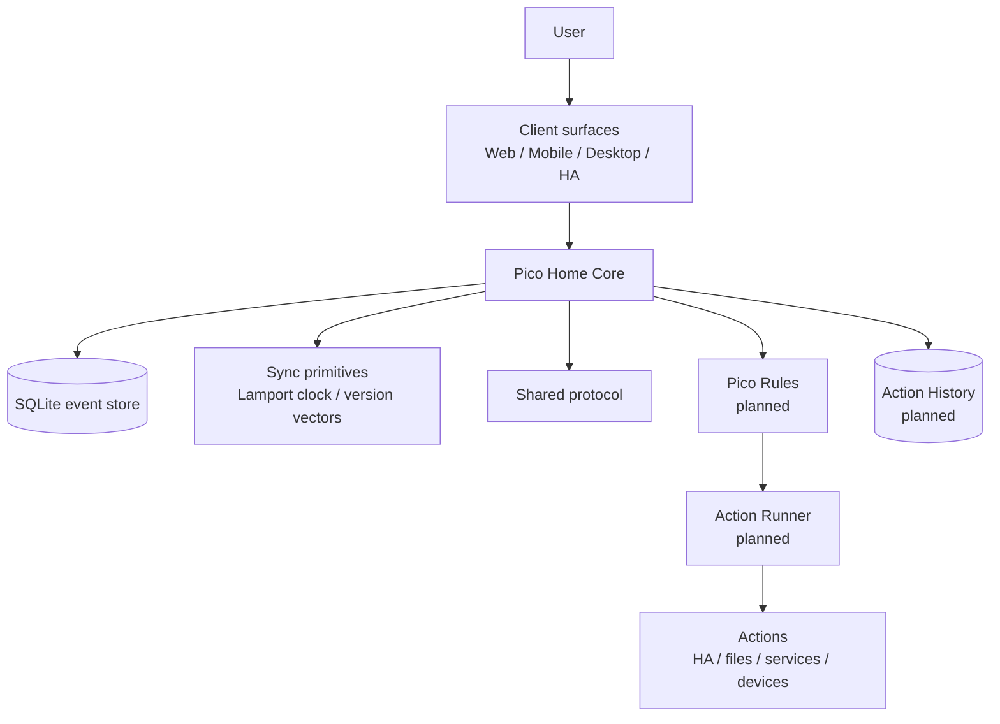
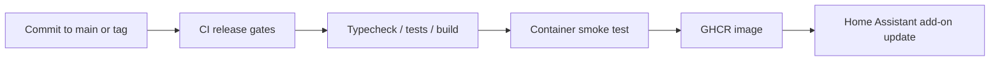
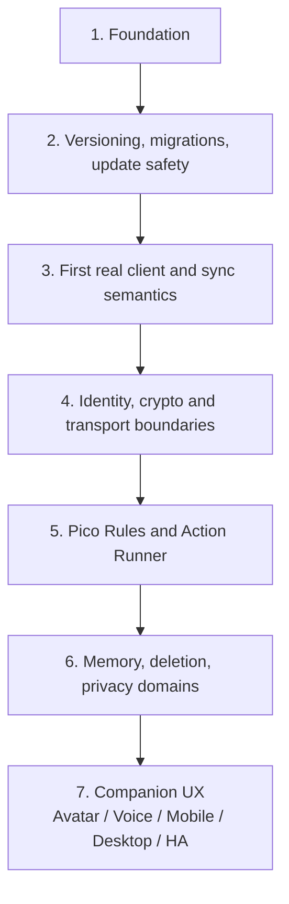

# Pico Technical README


This file is the technical companion to `README.md`.

`README.md` is the non-technical project introduction. `ReadmeTech.md` contains the technical details needed for contributors, reviewers, operators, and future architecture work.

## Public summary

Pico is a local-first personal AI companion foundation.

The project starts deliberately small. The current repository focuses on the foundation: a tested core service, a shared protocol package, sync primitives, a release pipeline, a foundation dashboard and a Home Assistant add-on path.

Home Assistant is the first packaging and runtime path, not the only intended platform and not an ownership layer for resident Pico identities or private data.

Remote reachability is intended to work through Pico Link transports, primarily Pico Relay, not by exposing Pico Home as a public inbound HTTP server.

The current Foundation HTTP and WebSocket API is a trusted-local diagnostics and foundation interface. Direct Foundation HTTP API access can be protected with the temporary `PICO_FOUNDATION_TOKEN`, but this is not a production authentication surface, authorization boundary, public remote-access API, Pico Link transport or Pico Home Link compatibility specification.

Do not expose port `3100` outside a trusted local development or Home Assistant add-on boundary. Current `deviceId` values are client-supplied event metadata, not verified device identity. Current `signature` values are stored as opaque, unverified metadata and are not cryptographic authorship or integrity proof.

ADR 0038 chooses a staged hardening direction: Home Assistant ingress for the add-on browser path, a temporary `PICO_FOUNDATION_TOKEN` for direct standalone/container access, and later local pairing or Setup Mode work for real product bootstrap. The current implementation supports `PICO_FOUNDATION_TOKEN` for direct Foundation HTTP API endpoints only; WebSocket token/session handling and Home Assistant ingress are still separate follow-up work.

## License and commercial use

Pico is source-available for private and non-commercial use under the PolyForm Noncommercial License 1.0.0.

Private Pico use, private Pico Home use and private Pico WG use are permitted, including family, household, private shared-home and private non-commercial friend-group use.

Commercial use requires prior written permission from the designated Pico rights holder. This includes paid hosting, managed Pico Home services, Pico Home rental, SaaS operation, paid support, business-internal use and integration into commercial products or services.

Current commercial permission contact:

```text
https://github.com/riederch
```

See:

- `LICENSE`
- `NOTICE`
- `COMMERCIAL.md`
- `LICENSE-FAQ.md`
- `TRADEMARK.md`
- `CONTRIBUTING.md`

## Current status

Pico is in the foundation phase.

Current version:

```text
0.1.7
```

Implemented or prepared:

- TypeScript monorepo
- Fastify-based Pico Home Core foundation service
- SQLite-backed append-only event store
- Lamport clock and version-vector helpers
- migration runner and backup-before-migration contract
- shared protocol package for events, avatar state, action terminology and compatibility aliases
- WebSocket endpoint for event streaming
- foundation diagnostics dashboard
- CI release gates
- Docker image build
- multi-arch GHCR publishing path
- Home Assistant add-on metadata
- architecture notes under `docs/architecture`
- protocol notes under `docs/protocol`
- license, commercial-use, trademark and contribution governance files

Not production-ready yet:

- authentication and authorization
- Pico Rules implementation
- Action Runner implementation
- encrypted personal data domains
- production migration and rollback orchestration
- real companion UI
- voice/avatar runtime
- multi-resident Pico Home tenancy implementation
- Pico Link relay transport implementation
- Pico identity, home identity and device key lifecycle implementation
- inter-Pico and Pico Home protocol conformance tests

## Architecture overview

ADR decision status and runtime implementation status are tracked separately in `docs/architecture/implementation-status.md`. An accepted ADR may still be concept-only or blocked before production.



## Core authority model

Pico separates suggestion, decision, execution, and audit:

> Pico may suggest. Pico Rules decide. The Action Runner acts only after approval. Action History records what happened.

The companion layer may feel helpful and present. Risky actions still need rules, approval and traceability.

## Pico Vaults, Pico Surfaces, Pico Relays and Pico Homes

Pico distinguishes these roles:

| Node type | Role | Data holding | Connectivity |
|---|---|---|---|
| Pico Vault | full Pico node | full knowledge, local database, sync state, backups where configured | direct, LAN, VPN, Pico Relay, future transport adapters |
| Pico Surface | interaction surface | minimal cache/session state only | requires Pico Vault, directly or via relay |
| Pico Relay | transport helper | no authority, no Pico memory ownership | forwards, queues and deduplicates encrypted Pico Link packets |

Pico also distinguishes these roles from a Pico Home:

| Host type | Role | Authority boundary |
|---|---|---|
| Pico Home | runtime and storage host for Pico Home Core; local endpoint in the Pico Link / Relay network | hosts infrastructure; does not automatically own resident Pico identities, private keys or personal domains |
| Empty Pico Home | freshly installed Pico Home | no resident Pico and no Home Host Pico yet |
| Claimed Pico Home | Pico Home claimed by a Home Host Pico | Home Host Pico can manage residency and future access, not resident private data |

Design rules:

> Pico Vaults own knowledge and backups. Pico Surfaces present and capture interaction. Pico Relays transport encrypted packets but do not own Pico identity, memory, relationships, actions or authority.

> A Pico Home provides infrastructure and acts as a local endpoint. Hosting is not ownership.

A freshly installed Pico Home starts empty. A one-time Move-In Code lets the first Pico claim the host. That first Pico becomes the Home Host Pico for this Pico Home. The Home Host Pico may invite additional Home Member Picos and may remove them from future use of this host, but it must not decrypt, impersonate, rewrite or own Home Member Picos.

A future Pico Home Image is an appliance-style installation path for the same model. It does not create a separate authority or trust model.

## Pico Link, Relay Network and transport facade

Pico Link is the future transport-neutral communication layer between Picos, Homes and related Pico endpoints.

Core rule:

```text
Pico speaks Pico Link. Transports carry Pico Link packets.
```

A future Pico Link packet should be encrypted above the transport. Relays and adapters may route, queue, retry, deduplicate, fragment or drop packets according to capability and policy, but they must not decrypt payloads, authorize actions, own identities, alter signed content or become trust anchors.

Remote reachability model:

```text
Pico Vault outside home
-> Pico Link Transport Facade
-> Pico Relay / Relay Network
-> Pico Home Endpoint
```

Pico Home should not be treated as a public inbound HTTP server for remote access. Remote reachability should use Pico Link transports, primarily Pico Relay, with Pico Home acting as an endpoint that can maintain outbound relay sessions where needed.

Concrete adapters may later include:

- Pico Relay
- LAN/direct
- VPN/direct
- WebSocket
- future QUIC/WebRTC-style transports
- Meshtastic
- future LoRa, BLE Mesh, Thread, Wi-Fi HaLow, Hamnet, APRS-like, MQTT-bridge or other low-bandwidth transports

Meshtastic is only a possible low-bandwidth adapter for small encrypted Pico Link packets such as presence, emergency short messages, wake-up hints or small store-and-forward messages. Meshtastic channel keys or node identities must not become Pico identity keys.

Picos can communicate across different Pico Homes. Homes define hosting, delivery and household context; they do not define or own the limits of relationships between Picos.

Details are documented in `docs/architecture/0028-pico-link-transport-facade-and-relay-network.md`.

## Cryptography boundaries

Pico may define sovereignty boundaries, trust relationships, identity concepts, payload domains and threat models.

Pico must not invent cryptography.

Future encryption work should evaluate established building blocks such as MLS, libsodium, age-style backup encryption, platform keystores, passkeys or hardware-backed identity where appropriate.

Pico Link requires asymmetric cryptographic identity material for Picos, devices and Homes. Public keys can act as portable identity material; private keys must remain under the control of Pico Vaults or other trusted key storage. Pico identity, device, Home, transport and domain keys are separate roles. PGP is an acceptable mental model for public/private key identity and signed messages, but it is not automatically the Pico Link wire protocol.

Details are documented in:

- `docs/architecture/0016-cryptography-boundaries-and-non-goals.md`
- `docs/architecture/0028-pico-link-transport-facade-and-relay-network.md`
- `docs/architecture/0029-identity-device-home-keys-and-e2e-boundaries.md`
- `docs/architecture/0031-pico-link-identity-relay-and-domain-threat-model.md`
- `docs/architecture/0032-pico-link-envelope-and-credential-schema-direction.md`
- `docs/architecture/0033-key-lifecycle-rotation-revocation-and-recovery.md`
- `docs/architecture/0034-canonicalization-signature-inputs-and-test-vectors.md`

## Server bootstrap, tenancy and eviction

Pico Homes use an empty-house model.

A freshly installed Pico Home starts empty. A one-time Move-In Code lets the first Pico move in and become the Home Host Pico for that host. The Home Host Pico may invite other Home Member Picos and may remove them from future use of the host.

Eviction is infrastructure revocation, not personal ownership transfer. The Home Host Pico may deny future use of this host, but it must not decrypt another resident's personal domain, steal keys, impersonate a resident, forge resident events, silently export resident data or destroy the resident Pico identity globally.

Design rule:

> The Home Host Pico manages the house, not the people. It may invite and remove Home Member Picos from this Pico Home, but it must not decrypt, impersonate, rewrite or own them.

Details are documented in:

- `docs/architecture/0024-server-bootstrap-tenancy-and-eviction.md`
- `docs/architecture/0027-dedicated-pico-home-image-and-first-boot-setup.md`

## Product terminology

Pico uses product-facing terminology as the primary language for humans and new implementation work where practical.

Examples:

| Product term | Legacy / technical term |
|---|---|
| Pico Home | Pico Core Host / server |
| Empty Pico Home | Unclaimed Host |
| Move-In Code | Bootstrap Claim Token |
| Home Host Pico | Gastgeber Pico / Host Admin |
| Home Member Pico | Resident Pico |
| Pico Vault | Full Client |
| Pico Surface | Light Client |
| Pico Relay | Relay Server |
| Pico Link | Inter-Pico Protocol |
| Pico Home Link | Pico-to-Core-Host Interface |
| Pico Rules | Policy Layer / Policy Engine |
| Action Runner | Executor |
| Action History | Audit Log |
| Approval Step | Confirmation Flow |
| Action Risk | Tool Risk Level |
| Action Catalog | Tool Registry |
| Context Signals | Trust Signals |

Details are documented in `docs/architecture/0026-product-terminology-and-naming.md`.

## Compatibility

An implementation that claims Pico protocol compatibility must preserve the published inter-Pico communication semantics for the protocol version it advertises.

The same applies to the Pico Home Link interface. A real Pico should be able to move into a compatible permitted fork server if that server faithfully implements the advertised host claim, residency, eviction, sync, routing and privacy-domain semantics.

Details are documented in:

- `docs/architecture/0025-inter-pico-communication-compatibility.md`
- `docs/protocol/public-surfaces.md`
- `docs/protocol/compatibility-levels.md`

## Repository structure

```text
.
├── apps
│   ├── core              # Fastify backend service
│   └── web               # foundation diagnostics dashboard
├── docker
│   └── core.Dockerfile   # Pico Home Core container image
├── docs
│   ├── architecture      # architecture decision notes and concept docs
│   ├── assets            # README/project assets
│   ├── protocol          # protocol compatibility and public surface notes
│   └── release           # release, versioning and documentation notes
├── packages
│   ├── protocol          # shared event and payload types
│   └── sync              # Lamport clock and version-vector helpers
├── pico_core             # active Home Assistant add-on metadata
├── repository.yaml       # Home Assistant add-on repository metadata
├── README.md             # non-technical project introduction
├── ReadmeTech.md         # full technical project documentation
├── LICENSE               # source-available non-commercial project license
├── COMMERCIAL.md         # commercial-use permission rules
├── TRADEMARK.md          # naming and compatibility claim rules
├── CONTRIBUTING.md       # contribution and documentation rules
└── .github/workflows     # CI pipeline
```

## Home Assistant add-on

Pico currently ships a foundation add-on definition under:

```text
pico_core/
```

`pico_core/` is the single source of truth for the Home Assistant add-on metadata.

The add-on uses the prebuilt container image:

```text
ghcr.io/riederch/pico/core
```

`pico_core/config.yaml` intentionally stores the image name without a literal tag. The versioned release artifact for add-on version `0.1.7` is:

```text
ghcr.io/riederch/pico/core:0.1.7
```

The published Git tag must match the add-on version and root package version exactly, for example `v0.1.7` for version `0.1.7`. Normal pushes to `main` publish only `main` and `sha-*` image tags and must not mutate existing semver image tags.

Current tag:

```text
0.1.7
```

The add-on exposes Pico Home Core on port `3100`, serves the foundation dashboard at `/`, and defines a watchdog against:

```text
/health
```

Port `3100` is a trusted local foundation interface for the current add-on. It is not the intended public remote-access surface. Future remote reachability should use Pico Link transports and Pico Relay instead of router port forwarding into the Pico Home API.

The current container keeps the platform default user so the Home Assistant `/data` mount stays writable for SQLite. This is a foundation-stage packaging constraint, not a security claim. A later hardening step should prepare `/data` ownership and drop privileges through a tested entrypoint or platform-specific setup.

## Current API surface

| Endpoint | Purpose |
|---|---|
| `GET /` | foundation diagnostics dashboard |
| `GET /health` | service health check |
| `GET /api/system/version` | service and protocol version information |
| `GET /api/system/status` | diagnostic service, capability, Pico Home claim-state and database migration status |
| `GET /api/events` | list stored events |
| `GET /api/events/tail` | latest foundation events for diagnostics dashboard use |
| `POST /api/events` | append an event |
| `WS /ws` | event stream endpoint |

`GET /api/events/tail` is diagnostics-only. It is not a replica sync protocol and does not provide durable sync cursors.

The current API surface is a foundation API. It is not yet a complete Pico Link or Pico Home Link specification, not a production authentication surface, not a public remote-access API and not a relay protocol.

When `PICO_FOUNDATION_TOKEN` is configured, direct HTTP calls to `/api/system/version`, `/api/system/status`, `/api/events` and `/api/events/tail`, plus direct `POST /api/events`, require `Authorization: Bearer <token>`. `/health`, the dashboard shell and `WS /ws` are not protected by this temporary token in the current implementation.

The exposure boundary for these endpoints is documented in `docs/architecture/0030-foundation-api-exposure-and-local-trust-boundary.md`. The staged local access hardening direction is documented in `docs/architecture/0038-foundation-local-access-hardening-and-ingress-boundary.md`.

## Local development

Install dependencies:

```bash
pnpm install
```

Run the full release verification locally:

```bash
pnpm release:verify
```

Start Pico Home Core:

```bash
pnpm dev:core
```

Open the foundation dashboard:

```text
http://localhost:3100/
```

Health check:

```bash
curl http://localhost:3100/health
```

Create a test event:

```bash
curl -X POST http://localhost:3100/api/events \
  -H 'content-type: application/json' \
  -d '{"deviceId":"desktop-dev","type":"message.created","payload":{"role":"user","text":"Hallo Pico"}}'
```

With `PICO_FOUNDATION_TOKEN` configured:

```bash
curl -X POST http://localhost:3100/api/events \
  -H 'authorization: Bearer <token>' \
  -H 'content-type: application/json' \
  -d '{"deviceId":"desktop-dev","type":"message.created","payload":{"role":"user","text":"Hallo Pico"}}'
```

List events:

```bash
curl http://localhost:3100/api/events
```

## Release and update flow



Release rule:

> No green pipeline, no release.

Version bump locations and the release checklist are documented in `docs/release/versioning.md`.

Documentation consistency rules are documented in `docs/release/documentation-consistency.md`.

## Binary asset workflow

Large or binary files such as PNG design assets are not edited directly through text-file patch workflows. When such files are needed, they should be prepared as a ZIP archive with the correct repository folder structure. The ZIP can be extracted in the repository root and committed locally.

Expected image asset paths:

```text
docs/assets/pico-design-concept.png
docs/assets/pico-ha-icon.png
docs/assets/pico-readme-hero.png
pico_core/icon.png
```

## Concept documents

The project concept is persisted as architecture notes:

| Document | Topic |
|---|---|
| `0001-foundation.md` | foundation architecture |
| `0002-peer-trust-and-relationships.md` | trust relationships between Pico instances |
| `0003-family-server-and-user-sovereignty.md` | shared server without loss of user sovereignty |
| `0004-parent-child-relationship.md` | guardian/child model |
| `0005-release-and-update-platform.md` | repo, release, and update model |
| `0006-testing-and-release-gates.md` | tests as release blockers |
| `0007-home-assistant-add-on-release.md` | HA add-on update path |
| `0008-product-vision-and-persona.md` | product vision and Pico persona |
| `0009-avatar-and-interaction-model.md` | avatar, voice, and interaction boundaries |
| `0010-tool-policy-and-executor-model.md` | legacy tool policy, executor, and risk classes |
| `0011-privacy-security-and-audit-model.md` | privacy, security, and audit principles |
| `0012-roadmap-foundation-to-companion.md` | roadmap from foundation to companion |
| `0013-visual-design-language.md` | visual identity, avatar states, status colors, and context modes |
| `0014-deletability-and-append-only-events.md` | deleteable memory, tombstones, payload references, and crypto-shredding direction |
| `0015-full-clients-light-clients-and-relay.md` | Pico Vaults, Pico Surfaces, Pico Relays and Pico Home distinction |
| `0016-cryptography-boundaries-and-non-goals.md` | cryptography scope, non-goals, and dependency on reviewed primitives |
| `0017-contextual-interaction-safety-and-trust-signals.md` | person-to-person interaction safety, evidence-labelled Context Signals, and abuse resistance |
| `0018-presence-context-and-location-sharing.md` | scoped presence, activity, ETA, emergency and location sharing |
| `0019-home-assistant-threat-model.md` | Home Assistant threat model, action boundaries and required controls |
| `0020-contextual-service-and-emergency-access.md` | service assistance, emergency infrastructure disclosure and medical emergency disclosure |
| `0021-private-behaviour-legal-risk-and-harm.md` | private behaviour, legal risk, harm, autonomy and anti-authoritarian posture |
| `0022-shared-commitments-and-cooperative-nudging.md` | Shared Plans, confirmations, reminders, nudging and anti-procrastination support |
| `0023-adaptive-tone-motivation-and-self-binding.md` | adaptive tone, motivation profiles and user-owned self-binding interventions |
| `0024-server-bootstrap-tenancy-and-eviction.md` | Empty Pico Home bootstrap, Home Host Pico, Home Member Pico and eviction boundaries |
| `0025-inter-pico-communication-compatibility.md` | inter-Pico and Pico Home protocol compatibility, permitted fork compatibility and conformance expectations |
| `0026-product-terminology-and-naming.md` | product terminology map, naming aliases and authority boundaries |
| `0027-dedicated-pico-home-image-and-first-boot-setup.md` | dedicated Pico Home Image, appliance first boot, Setup Mode and Move-In Code boundaries |
| `0028-pico-link-transport-facade-and-relay-network.md` | Pico Link Transport Facade, Relay Network, Pico Home endpoints, decentralised relays and low-bandwidth transport adapters |
| `0029-identity-device-home-keys-and-e2e-boundaries.md` | Pico identity keys, device keys, Home keys, transport keys, signatures and E2E encryption boundaries |
| `0030-foundation-api-exposure-and-local-trust-boundary.md` | current Foundation API exposure, local trust boundary and prerequisites before broader access |
| `0031-pico-link-identity-relay-and-domain-threat-model.md` | Pico Link identity, relay metadata and protected-domain threat model |
| `0032-pico-link-envelope-and-credential-schema-direction.md` | Pico Link envelope, protected payload, signed history, key envelope and membership credential schema direction |
| `0033-key-lifecycle-rotation-revocation-and-recovery.md` | key lifecycle, rotation, revocation, lost-device, reset and recovery boundaries |
| `0034-canonicalization-signature-inputs-and-test-vectors.md` | canonicalization, signature-input, rejection and test-vector boundaries |
| `0035-pico-as-digital-companion-and-twin-model.md` | Pico as digital companion and technical twin of a chosen subject |
| `0036-capabilities-connectors-and-mcp-boundary.md` | capabilities, connectors and MCP as tool connection method rather than authority |
| `0037-proactive-companion-delegation-and-procurement.md` | proactive delegation boundaries and procurement reference case |
| `0038-foundation-local-access-hardening-and-ingress-boundary.md` | staged Foundation access hardening, Home Assistant ingress and temporary direct-access token boundary |

Protocol documents:

| Document | Topic |
|---|---|
| `docs/protocol/public-surfaces.md` | current and planned public compatibility surfaces |
| `docs/protocol/compatibility-levels.md` | compatibility level definitions and claim boundaries |
| `docs/protocol/conformance-fixtures.md` | non-cryptographic conformance fixture layout and Foundation event/realtime fixture seed |

## Roadmap



### Optional walking-skeleton tech demo

A small executable architecture sketch may be useful after the identity, transport, relay, encryption, lifecycle and canonicalization boundaries have concrete threat-model, wire-schema and fixture drafts.

This demo should be non-blocking and deliberately thin:

- a demo Pico Vault creates an opaque Pico Link-style packet
- a demo Pico Relay forwards or queues it while seeing only routing metadata
- Pico Home acts as a local endpoint, not as a public inbound API server
- a demo Pico Surface displays limited diagnostic state
- cryptography, membership, claim, auth and conformance claims stay stubbed or explicitly out of scope unless the corresponding designs already exist

The demo must not become the path for production remote access. If it starts forcing rushed decisions in key lifecycle, relay trust, Home membership, auth, payload encryption, deletion or conformance, it should wait.

## Design principles

- Local-first where practical
- User sovereignty over identity and personal data
- Explicit privacy domains
- No unrestricted shell for the LLM
- Pico Rules before risky actions
- Approval for risky actions
- Action History instead of hidden automation
- Append-only event and audit thinking, without embedding sensitive deleteable memory directly in immutable events
- Tests block releases
- Updates must become reversible before real data matters
- Friendly visual companion layer, strict execution layer
- Pico can be a digital companion and technical twin of a user-chosen subject
- Use reviewed cryptographic primitives; do not invent cryptography
- Pico Vaults own knowledge and backups; Pico Surfaces are interaction surfaces
- Pico Homes provide infrastructure; hosting is not ownership
- Pico Homes are local endpoints in the Pico Link / Relay network, not public inbound API servers
- Pico Relays provide transport, not authority
- Pico Link remains transport-neutral; Relay, LAN, VPN/direct, Meshtastic and future radio transports belong behind adapters
- Meshtastic and future radio transports are optional low-bandwidth adapters, not Pico identity or authority layers
- Pico identity, device, Home, transport and domain keys are separate roles
- The current Foundation API remains local/trusted until auth, membership, policy and Pico Link boundaries exist
- A Home Host Pico may manage residency on a Pico Home, not resident private data
- Picos can communicate across Homes; relationships belong to Picos, not Homes
- Pico-compatible permitted forks must preserve inter-Pico and Pico Home protocol semantics for the advertised protocol version
- Compatibility does not grant commercial hosting permission
- Capabilities are evaluated above connector protocols; MCP is not an authority layer
- Proactive delegation must remain bounded by user-owned preferences, policy decisions, confirmation and Action History
- Context Signals are contextual evidence, not global human scores
- Remote Pico self-presentation must never be transformed into trust
- Presence, activity and location sharing must be scoped, visible, revocable, purpose-bound and minimally precise
- Service and emergency disclosures must be role-, context-, purpose- and necessity-bound, minimal, expiring and auditable
- Private behaviour must be evaluated by harm and risk, not by legality, taboo or obedience alone
- Pico assists; Pico does not police
- Shared Plans should manage next actions, not judge people
- Motivational pressure must be user-owned

## Next implementation steps

- Validate the Home Assistant add-on on a real HA installation
- Prepare the next versioned foundation release
- Define first merge semantics for client state before deeper offline editing
- Implement a narrow ADR 0038 Foundation access-hardening milestone before exposing Pico Home APIs beyond trusted local paths
- Use ADR 0031, ADR 0032, ADR 0033 and ADR 0034 to refine identity/device/home key wire schemas, rotation semantics, canonicalization and conformance tests before real Pico Link communication
- Optionally build the walking-skeleton tech demo only after those drafts exist, and only if it does not slow the foundation schedule
- Define stable public protocol schemas for Pico Link and Pico Home Link
- Add conformance tests before any strong compatibility claim
- Add the first Pico Rules-gated read-only action only after the relevant policy boundary is in place
