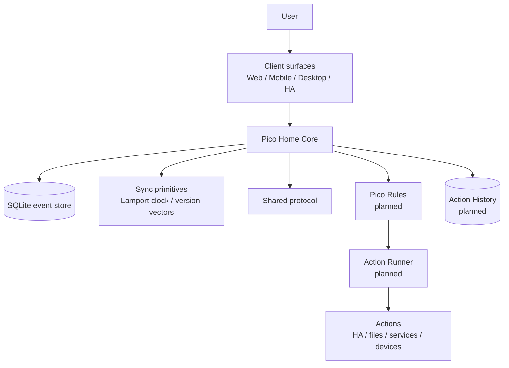
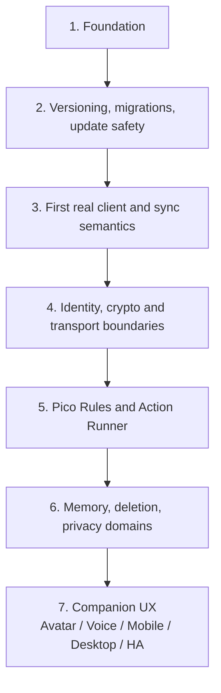

# Pico Technical README


This file is the technical companion to `README.md`.

`README.md` is the non-technical project introduction. `ReadmeTech.md` contains the technical details needed for contributors, reviewers, operators, and future architecture work.

## Public summary

Pico is a local-first personal AI companion foundation.

The project starts deliberately small. The current repository focuses on the foundation: a tested core service, a shared protocol package, sync primitives, a release pipeline, a foundation dashboard and a Home Assistant add-on path.

Home Assistant is the first packaging and runtime path, not the only intended platform and not an ownership layer for resident Pico identities or private data.

Remote reachability is intended to work through Pico Link transports, primarily Pico Relay, not by exposing Pico Home as a public inbound HTTP server.

The current Foundation HTTP and WebSocket API is a trusted-local diagnostics and foundation interface. Direct Foundation HTTP API and realtime access can be protected with the temporary `PICO_FOUNDATION_TOKEN` and short-lived WebSocket tickets, but this is not a production authentication surface, authorization boundary, public remote-access API, Pico Link transport or Pico Home Link compatibility specification.

Do not expose port `3100` outside a trusted local development or Home Assistant add-on boundary. Current `deviceId` values are client-supplied event metadata, not verified device identity. Current `signature` values are stored as opaque, unverified metadata and are not cryptographic authorship or integrity proof.

ADR 0038 chooses a staged hardening direction: Home Assistant ingress for the add-on browser path, a temporary `PICO_FOUNDATION_TOKEN` for direct standalone/container access, and later local pairing or Setup Mode work for real product bootstrap. The current implementation supports `PICO_FOUNDATION_TOKEN` for direct Foundation HTTP API endpoints and ADR 0039 short-lived WebSocket tickets for direct realtime access. ADR 0040 now defines the Home Assistant ingress metadata, add-on token option and packaging-default direction. Current ADR 0040 slices implement ingress metadata, ingress-prefix-aware dashboard URLs, the `pico_foundation_token` add-on option bridge and default direct host-port disablement; real HA install validation remains open. ADR 0041 implements the `PICO_FOUNDATION_ACCESS_MODE` startup gate.

## License and commercial use

Pico is source-available for private and non-commercial use under the PolyForm Noncommercial License 1.0.0.

Private Pico use, private Pico Home use and private Pico WG use are permitted, including family, household, private shared-home and private non-commercial friend-group use.

Business use is permitted on a self-operated Pico Home: an entity may run one or more Picos for itself when it holds custody of that Pico Home's host keys and operates the Pico Home itself. Paid installation, maintenance and support by a third party are permitted; the third party must not operate the Pico Home or hold its host keys as a service provider.

Commercial Pico hosting stays with the designated Pico rights holder. Paid hosting, managed Pico Home services, Pico Home rental, multi-tenant hosting, operating a Pico Home on behalf of another party, SaaS operation, selling Pico or Pico-based products, and integration into commercial products or services require prior written permission.

Current commercial permission contact:

```text
https://github.com/riederch
```

See:

- `LICENSE`
- `NOTICE`
- `COMMERCIAL.md`
- `LICENSE-FAQ.md`
- `TRADEMARK.md`
- `CONTRIBUTING.md`

## Current status

Pico is in the foundation phase.

Current version:

```text
0.1.9
```

Implemented or prepared:

- TypeScript monorepo
- Fastify-based Pico Home Core foundation service
- SQLite-backed append-only event store
- Lamport clock and version-vector helpers
- minimal `@pico/identity` signature verification and lifecycle runtime for identity/device-key statements
- minimal `@pico/vault` keyfile runtime for person-role custody tests
- first `@pico/vault-daemon` local Vault process slice: private Unix-socket boundary, named request families and hold-bound unlock/lock lifecycle (ADR 0097, Linux first)
- bounded reader-access lease over that daemon, so the Reader path runs without the reader's private key in the consumer process (ADR 0098)
- per-request approval for authority-creating signatures, decided on the terminal that holds the unlock and bound to the exact bytes (ADR 0099)
- ceremony signing over that daemon through a structural detached signer, so the identity root key stays out of the processes that build records; key-agreement operations remain local by design (ADR 0100)
- domain creation and KEK rotation executed inside the daemon under one input-digest-bound approval each, so fresh KEKs are born inside the boundary and a rotation costs one decision instead of one per reader (ADR 0101)
- several keys unlocked concurrently, each held and locked by its own terminal, with every key use naming its key; reader grants then run daemon-side under a single approval (ADR 0102)
- migration runner and backup-before-migration contract
- shared protocol package for events, avatar state and canonical product action terminology
- WebSocket endpoint for event streaming
- foundation diagnostics dashboard with an operator login and a small administration area (retention policies, crypto-shred)
- CI release gates
- Docker image build
- multi-arch GHCR publishing path
- Home Assistant add-on metadata
- architecture notes under `docs/architecture`
- protocol notes under `docs/protocol`
- license, commercial-use, trademark and contribution governance files

Not production-ready yet:

- authentication and authorization
- Pico Rules implementation
- Action Runner implementation
- encrypted personal data domains
- production migration and rollback orchestration
- real companion UI
- voice/avatar runtime
- multi-resident Pico Home tenancy implementation
- Pico Link relay transport implementation
- Pico identity, home identity and device key lifecycle implementation
- inter-Pico and Pico Home protocol conformance tests

## Architecture overview

ADR decision status and runtime implementation status are tracked separately in `docs/architecture/implementation-status.md`. An accepted ADR may still be concept-only or blocked before production.



## Core authority model

Pico separates suggestion, decision, execution, and audit:

> Pico may suggest. Pico Rules decide. The Action Runner acts only after approval. Action History records what happened.

The companion layer may feel helpful and present. Risky actions still need rules, approval and traceability.

## Pico Vaults, Pico Surfaces, Pico Relays and Pico Homes

Pico distinguishes these roles:

| Node type | Role | Data holding | Connectivity |
|---|---|---|---|
| Pico Vault | full Pico node | full knowledge, local database, sync state, backups where configured | direct, LAN, VPN, Pico Relay, future transport adapters |
| Pico Surface | interaction surface | minimal cache/session state only | requires Pico Vault, directly or via relay |
| Pico Relay | transport helper | no authority, no Pico memory ownership | forwards, queues and deduplicates encrypted Pico Link packets |

Pico also distinguishes these roles from a Pico Home:

| Host type | Role | Authority boundary |
|---|---|---|
| Pico Home | runtime and storage host for Pico Home Core; local endpoint in the Pico Link / Relay network | hosts infrastructure; does not automatically own resident Pico identities, private keys or personal domains |
| Empty Pico Home | freshly installed Pico Home | no resident Pico and no Home Host Pico yet |
| Claimed Pico Home | Pico Home claimed by a Home Host Pico | Home Host Pico can manage residency and future access, not resident private data |

Design rules:

> Pico Vaults own knowledge and backups. Pico Surfaces present and capture interaction. Pico Relays transport encrypted packets but do not own Pico identity, memory, relationships, actions or authority.

> A Pico Home provides infrastructure and acts as a local endpoint. Hosting is not ownership.

A freshly installed Pico Home starts empty. A one-time Move-In Code lets the first Pico claim the host. That first Pico becomes the Home Host Pico for this Pico Home. The Home Host Pico may invite additional Home Member Picos and may remove them from future use of this host, but it must not decrypt, impersonate, rewrite or own Home Member Picos.

A future Pico Home Image is an appliance-style installation path for the same model. It does not create a separate authority or trust model.

## Pico Link, Relay Network and transport facade

Pico Link is the future transport-neutral communication layer between Picos, Homes and related Pico endpoints.

Core rule:

```text
Pico speaks Pico Link. Transports carry Pico Link packets.
```

A future Pico Link packet should be encrypted above the transport. Relays and adapters may route, queue, retry, deduplicate, fragment or drop packets according to capability and policy, but they must not decrypt payloads, authorize actions, own identities, alter signed content or become trust anchors.

Remote reachability model:

```text
Pico Vault outside home
-> Pico Link Transport Facade
-> Pico Relay / Relay Network
-> Pico Home Endpoint
```

Pico Home should not be treated as a public inbound HTTP server for remote access. Remote reachability should use Pico Link transports, primarily Pico Relay, with Pico Home acting as an endpoint that can maintain outbound relay sessions where needed.

Concrete adapters may later include:

- Pico Relay
- LAN/direct
- VPN/direct
- WebSocket
- future QUIC/WebRTC-style transports
- Meshtastic
- future LoRa, BLE Mesh, Thread, Wi-Fi HaLow, Hamnet, APRS-like, MQTT-bridge or other low-bandwidth transports

Meshtastic is only a possible low-bandwidth adapter for small encrypted Pico Link packets such as presence, emergency short messages, wake-up hints or small store-and-forward messages. Meshtastic channel keys or node identities must not become Pico identity keys.

Picos can communicate across different Pico Homes. Homes define hosting, delivery and household context; they do not define or own the limits of relationships between Picos.

Details are documented in `docs/architecture/0028-pico-link-transport-facade-and-relay-network.md`.

## Cryptography boundaries

Pico may define sovereignty boundaries, trust relationships, identity concepts, payload domains and threat models.

Pico must not invent cryptography.

Future encryption work should evaluate established building blocks such as MLS, libsodium, age-style backup encryption, platform keystores, passkeys or hardware-backed identity where appropriate.

Pico Link requires asymmetric cryptographic identity material for Picos, devices and Homes. Public keys can act as portable identity material; private keys must remain under the control of Pico Vaults or other trusted key storage. Pico identity, device, Home, transport and domain keys are separate roles. PGP is an acceptable mental model for public/private key identity and signed messages, but it is not automatically the Pico Link wire protocol.

Details are documented in:

- `docs/architecture/0016-cryptography-boundaries-and-non-goals.md`
- `docs/architecture/0028-pico-link-transport-facade-and-relay-network.md`
- `docs/architecture/0029-identity-device-home-keys-and-e2e-boundaries.md`
- `docs/architecture/0031-pico-link-identity-relay-and-domain-threat-model.md`
- `docs/architecture/0032-pico-link-envelope-and-credential-schema-direction.md`
- `docs/architecture/0033-key-lifecycle-rotation-revocation-and-recovery.md`
- `docs/architecture/0034-canonicalization-signature-inputs-and-test-vectors.md`

## Server bootstrap, tenancy and eviction

Pico Homes use an empty-house model.

A freshly installed Pico Home starts empty. A one-time Move-In Code lets the first Pico move in and become the Home Host Pico for that host. The Home Host Pico may invite other Home Member Picos and may remove them from future use of the host.

Eviction is infrastructure revocation, not personal ownership transfer. The Home Host Pico may deny future use of this host, but it must not decrypt another resident's personal domain, steal keys, impersonate a resident, forge resident events, silently export resident data or destroy the resident Pico identity globally.

Design rule:

> The Home Host Pico manages the house, not the people. It may invite and remove Home Member Picos from this Pico Home, but it must not decrypt, impersonate, rewrite or own them.

Details are documented in:

- `docs/architecture/0024-server-bootstrap-tenancy-and-eviction.md`
- `docs/architecture/0027-dedicated-pico-home-image-and-first-boot-setup.md`

## Product terminology

Pico uses product-facing terminology as the primary language for humans and new implementation work where practical.

Examples:

| Product term | Legacy / technical term |
|---|---|
| Pico Home | Pico Core Host / server |
| Empty Pico Home | Unclaimed Host |
| Move-In Code | Bootstrap Claim Token |
| Home Host Pico | Gastgeber Pico / Host Admin |
| Home Member Pico | Resident Pico |
| Pico Vault | Full Client |
| Pico Surface | Light Client |
| Pico Relay | Relay Server |
| Pico Link | Inter-Pico Protocol |
| Pico Home Link | Pico-to-Core-Host Interface |
| Pico Rules | Policy Layer / Policy Engine |
| Action Runner | Executor |
| Action History | Audit Log |
| Approval Step | Confirmation Flow |
| Action Risk | Tool Risk Level |
| Action Catalog | Tool Registry |
| Context Signals | Trust Signals |

Details are documented in `docs/architecture/0026-product-terminology-and-naming.md`.

## Compatibility

An implementation that claims Pico protocol compatibility must preserve the published inter-Pico communication semantics for the protocol version it advertises.

The same applies to the Pico Home Link interface. A real Pico should be able to move into a compatible permitted fork server if that server faithfully implements the advertised host claim, residency, eviction, sync, routing and privacy-domain semantics.

Details are documented in:

- `docs/architecture/0025-inter-pico-communication-compatibility.md`
- `docs/protocol/public-surfaces.md`
- `docs/protocol/compatibility-levels.md`

## Repository structure

```text
.
├── apps
│   ├── core              # Fastify backend service
│   ├── vault-daemon      # local Pico Vault daemon, CLI, reader-access lease and approval (ADR 0097-0099)
│   └── web               # foundation diagnostics dashboard
├── docker
│   └── core.Dockerfile   # Pico Home Core container image
├── docs
│   ├── architecture      # architecture decision notes and concept docs
│   ├── assets            # README/project assets
│   ├── protocol          # protocol compatibility and public surface notes
│   └── release           # release, versioning and documentation notes
├── packages
│   ├── identity          # minimal identity signature verification and lifecycle projection runtime
│   ├── protocol          # shared event and payload types
│   ├── sync              # Lamport clock and version-vector helpers
│   └── vault             # minimal person-role keyfile runtime
├── pico_core             # active Home Assistant add-on metadata
├── repository.yaml       # Home Assistant add-on repository metadata
├── README.md             # non-technical project introduction
├── ReadmeTech.md         # full technical project documentation
├── LICENSE               # source-available non-commercial project license
├── COMMERCIAL.md         # commercial-use permission rules
├── TRADEMARK.md          # naming and compatibility claim rules
├── CONTRIBUTING.md       # contribution and documentation rules
└── .github/workflows     # CI pipeline
```

## Home Assistant add-on

Pico currently ships a foundation add-on definition under:

```text
pico_core/
```

`pico_core/` is the single source of truth for the Home Assistant add-on metadata.

The add-on uses the prebuilt container image:

```text
ghcr.io/riederch/pico/core
```

`pico_core/config.yaml` intentionally stores the image name without a literal tag. The versioned release artifact for add-on version `0.1.9` is:

```text
ghcr.io/riederch/pico/core:0.1.9
```

The published Git tag must match the add-on version and root package version exactly, for example `v0.1.9` for version `0.1.9`. Normal pushes to `main` publish only `main` and `sha-*` image tags and must not mutate existing semver image tags.

Current tag:

```text
0.1.9
```

The add-on exposes Pico Home Core on port `3100`, serves the foundation dashboard at `/`, and defines a watchdog against:

```text
/health
```

Port `3100` is a trusted local foundation interface for the current add-on. It is not the intended public remote-access surface. Future remote reachability should use Pico Link transports and Pico Relay instead of router port forwarding into the Pico Home API.

The current container keeps the platform default user so the Home Assistant `/data` mount stays writable for SQLite. This is a foundation-stage packaging constraint, not a security claim. A later hardening step should prepare `/data` ownership and drop privileges through a tested entrypoint or platform-specific setup.

## Current API surface

| Endpoint | Purpose |
|---|---|
| `GET /` | foundation diagnostics dashboard |
| `GET /health` | service health check |
| `GET /api/system/version` | service and protocol version information |
| `GET /api/system/status` | diagnostic service, capability, Pico Home claim-state and database migration status |
| `GET /api/events` | list stored events |
| `GET /api/events/tail` | latest foundation events for diagnostics dashboard use |
| `POST /api/realtime/tickets` | mint a short-lived realtime ticket for `WS /ws` when token mode is enabled |
| `POST /api/events` | append an event |
| `WS /ws` | event stream endpoint |

`GET /api/events/tail` is diagnostics-only. It is not a replica sync protocol and does not provide durable sync cursors.

The current API surface is a foundation API. It is not yet a complete Pico Link or Pico Home Link specification, not a production authentication surface, not a public remote-access API and not a relay protocol.

When `PICO_FOUNDATION_TOKEN` is configured, direct HTTP calls to `/api/system/version`, `/api/system/status`, `/api/events`, `/api/events/tail` and `/api/realtime/tickets`, plus direct `POST /api/events`, require `Authorization: Bearer <token>`. `/health` and the dashboard shell remain open.

For direct `WS /ws` access in token mode, browser clients mint a short-lived, single-use realtime ticket through `POST /api/realtime/tickets` and use only that ticket for the WebSocket upgrade. Non-browser clients may use `Authorization: Bearer <token>` on the upgrade request. The long-lived `PICO_FOUNDATION_TOKEN` must not be placed in a WebSocket URL.

The exposure boundary for these endpoints is documented in `docs/architecture/0030-foundation-api-exposure-and-local-trust-boundary.md`. The staged local access hardening direction is documented in `docs/architecture/0038-foundation-local-access-hardening-and-ingress-boundary.md`. The direct WebSocket ticket boundary is documented in `docs/architecture/0039-foundation-websocket-ticket-boundary.md`. The Home Assistant ingress and add-on packaging option direction is documented in `docs/architecture/0040-foundation-home-assistant-ingress-and-addon-token-options.md`. The next explicit access-mode gate is documented in `docs/architecture/0041-foundation-access-modes-and-direct-port-gate.md`.

## Local development

Install dependencies:

```bash
pnpm install
```

Run the full release verification locally:

```bash
pnpm release:verify
```

Start Pico Home Core:

```bash
pnpm dev:core
```

Open the foundation dashboard:

```text
http://localhost:3100/
```

Health check:

```bash
curl http://localhost:3100/health
```

Create a test event:

```bash
curl -X POST http://localhost:3100/api/events \
  -H 'content-type: application/json' \
  -d '{"deviceId":"desktop-dev","type":"message.created","payload":{"role":"user","text":"Hallo Pico"}}'
```

With `PICO_FOUNDATION_TOKEN` configured:

```bash
curl -X POST http://localhost:3100/api/events \
  -H 'authorization: Bearer <token>' \
  -H 'content-type: application/json' \
  -d '{"deviceId":"desktop-dev","type":"message.created","payload":{"role":"user","text":"Hallo Pico"}}'
```

Standalone/container exposure beyond loopback must also use an explicit access mode:

```bash
PICO_HOST=0.0.0.0 \
PICO_FOUNDATION_ACCESS_MODE=direct-token \
PICO_FOUNDATION_TOKEN=<token> \
pnpm dev:core
```

The accepted access modes are `loopback-dev`, `direct-token` and `ha-ingress`.
Tokenless direct non-loopback startup fails closed; CI direct-port smokes use
`direct-token` with disposable tokens.

ADR 0107's direct Link slice can instead expose a separate envelope-only
listener while the Foundation listener remains local:

```bash
PICO_HOST=127.0.0.1 \
PICO_FOUNDATION_ACCESS_MODE=loopback-dev \
PICO_LINK_INTAKE_HOST=0.0.0.0 \
PICO_LINK_INTAKE_PORT=3101 \
pnpm dev:core
```

Both Link variables are required together, the port must differ from
`PICO_PORT`, and this restricted listener cannot be combined with
`direct-token`. It accepts exactly `POST /api/home/link`; dashboard, health,
diagnostics, Foundation APIs, WebSocket, query variants and other methods are
not routed. This is a controlled direct/LAN validation path, not a public
reverse-proxy or port-forwarding product model. Remote product reachability
still belongs to Pico Relay.

Mint a short-lived realtime ticket for browser WebSocket access:

```bash
curl -X POST http://localhost:3100/api/realtime/tickets \
  -H 'authorization: Bearer <token>'
```

List events:

```bash
curl http://localhost:3100/api/events
```

## Release and update flow


Release rule:

> No green pipeline, no release.

Version bump locations and the release checklist are documented in `docs/release/versioning.md`.

Documentation consistency rules are documented in `docs/release/documentation-consistency.md`.

## Binary asset workflow

Large or binary files such as PNG design assets are not edited directly through text-file patch workflows. When such files are needed, they should be prepared as a ZIP archive with the correct repository folder structure. The ZIP can be extracted in the repository root and committed locally.

Expected image asset paths:

```text
docs/assets/pico-design-concept.png
docs/assets/pico-ha-icon.png
docs/assets/pico-readme-hero.png
pico_core/icon.png
```

## Concept documents

The project concept is persisted as architecture notes:

| Document | Topic |
|---|---|
| `0001-foundation.md` | foundation architecture |
| `0002-peer-trust-and-relationships.md` | trust relationships between Pico instances |
| `0003-family-server-and-user-sovereignty.md` | shared server without loss of user sovereignty |
| `0004-parent-child-relationship.md` | guardian/child model |
| `0005-release-and-update-platform.md` | repo, release, and update model |
| `0006-testing-and-release-gates.md` | tests as release blockers |
| `0007-home-assistant-add-on-release.md` | HA add-on update path |
| `0008-product-vision-and-persona.md` | product vision and Pico persona |
| `0009-avatar-and-interaction-model.md` | avatar, voice, and interaction boundaries |
| `0010-tool-policy-and-executor-model.md` | legacy tool policy, executor, and risk classes |
| `0011-privacy-security-and-audit-model.md` | privacy, security, and audit principles |
| `0012-roadmap-foundation-to-companion.md` | roadmap from foundation to companion |
| `0013-visual-design-language.md` | visual identity, avatar states, status colors, and context modes |
| `0014-deletability-and-append-only-events.md` | deleteable memory, tombstones, payload references, and crypto-shredding direction |
| `0015-full-clients-light-clients-and-relay.md` | Pico Vaults, Pico Surfaces, Pico Relays and Pico Home distinction |
| `0016-cryptography-boundaries-and-non-goals.md` | cryptography scope, non-goals, and dependency on reviewed primitives |
| `0017-contextual-interaction-safety-and-trust-signals.md` | person-to-person interaction safety, evidence-labelled Context Signals, and abuse resistance |
| `0018-presence-context-and-location-sharing.md` | scoped presence, activity, ETA, emergency and location sharing |
| `0019-home-assistant-threat-model.md` | Home Assistant threat model, action boundaries and required controls |
| `0020-contextual-service-and-emergency-access.md` | service assistance, emergency infrastructure disclosure and medical emergency disclosure |
| `0021-private-behaviour-legal-risk-and-harm.md` | private behaviour, legal risk, harm, autonomy and anti-authoritarian posture |
| `0022-shared-commitments-and-cooperative-nudging.md` | Shared Plans, confirmations, reminders, nudging and anti-procrastination support |
| `0023-adaptive-tone-motivation-and-self-binding.md` | adaptive tone, motivation profiles and user-owned self-binding interventions |
| `0024-server-bootstrap-tenancy-and-eviction.md` | Empty Pico Home bootstrap, Home Host Pico, Home Member Pico and eviction boundaries |
| `0025-inter-pico-communication-compatibility.md` | inter-Pico and Pico Home protocol compatibility, permitted fork compatibility and conformance expectations |
| `0026-product-terminology-and-naming.md` | product terminology map, naming aliases and authority boundaries |
| `0027-dedicated-pico-home-image-and-first-boot-setup.md` | dedicated Pico Home Image, appliance first boot, Setup Mode and Move-In Code boundaries |
| `0028-pico-link-transport-facade-and-relay-network.md` | Pico Link Transport Facade, Relay Network, Pico Home endpoints, decentralised relays and low-bandwidth transport adapters |
| `0029-identity-device-home-keys-and-e2e-boundaries.md` | Pico identity keys, device keys, Home keys, transport keys, signatures and E2E encryption boundaries |
| `0030-foundation-api-exposure-and-local-trust-boundary.md` | current Foundation API exposure, local trust boundary and prerequisites before broader access |
| `0031-pico-link-identity-relay-and-domain-threat-model.md` | Pico Link identity, relay metadata and protected-domain threat model |
| `0032-pico-link-envelope-and-credential-schema-direction.md` | Pico Link envelope, protected payload, signed history, key envelope and membership credential schema direction |
| `0033-key-lifecycle-rotation-revocation-and-recovery.md` | key lifecycle, rotation, revocation, lost-device, reset and recovery boundaries |
| `0034-canonicalization-signature-inputs-and-test-vectors.md` | canonicalization, signature-input, rejection and test-vector boundaries |
| `0035-pico-as-digital-companion-and-twin-model.md` | Pico as digital companion and technical twin of a chosen subject |
| `0036-capabilities-connectors-and-mcp-boundary.md` | capabilities, connectors and MCP as tool connection method rather than authority |
| `0037-proactive-companion-delegation-and-procurement.md` | proactive delegation boundaries and procurement reference case |
| `0038-foundation-local-access-hardening-and-ingress-boundary.md` | staged Foundation access hardening, Home Assistant ingress and temporary direct-access token boundary |
| `0039-foundation-websocket-ticket-boundary.md` | direct-access Foundation WebSocket ticket boundary |
| `0040-foundation-home-assistant-ingress-and-addon-token-options.md` | concrete Home Assistant ingress metadata, add-on token option and packaging-default direction |
| `0041-foundation-access-modes-and-direct-port-gate.md` | explicit Foundation access modes and direct-port gate |
| `0042-pico-link-draft-schema-and-fixture-gate.md` | draft-only Pico Link schema and fixture staging gate |
| `0043-pico-link-draft-packet-envelope-preflight.md` | draft-only Pico Link packet-envelope preflight shape |
| `0044-pico-link-draft-protected-payload-placeholder.md` | draft-only Pico Link protected-payload placeholder boundary |
| `0045-pico-home-link-draft-membership-credential-placeholder.md` | draft-only Pico Home Link membership-credential placeholder boundary |
| `0046-draft-compatibility-claim-placeholder.md` | draft-only compatibility-claim placeholder boundary |
| `0047-draft-canonicalization-rejection-placeholder.md` | draft-only canonicalization rejection placeholder boundary |
| `0048-model-capability-delegation-and-remote-inference-boundary.md` | delegated model capability and remote inference authority boundary |
| `0049-model-provider-registry-and-job-envelope.md` | model provider registry and scoped job-envelope direction |
| `0050-model-delegation-draft-fixture-gate.md` | draft-only model delegation fixture staging gate |
| `0051-pico-link-draft-device-credential-placeholder.md` | draft-only Pico Link device credential placeholder boundary |
| `0052-pico-link-draft-lost-device-revocation-placeholder.md` | draft-only Pico Link lost-device revocation placeholder boundary |
| `0053-pico-link-draft-revocation-registry-placeholder.md` | draft-only Pico Link revocation registry placeholder boundary |
| `0054-pico-link-draft-key-envelope-rotation-placeholder.md` | draft-only Pico Link key-envelope rotation placeholder boundary |
| `0055-pico-link-draft-identity-key-placeholder.md` | draft-only Pico Link identity-key placeholder boundary |
| `0056-pico-home-link-draft-home-host-key-placeholder.md` | draft-only Pico Home Link Home Host Key placeholder boundary |
| `0057-pico-home-link-draft-residency-eviction-placeholder.md` | draft-only Pico Home Link residency and eviction placeholder boundary |
| `0058-model-delegation-draft-job-envelope-scoping-placeholder.md` | draft-only Model Delegation job-envelope scoping placeholder boundary |
| `0059-model-delegation-draft-result-envelope-provenance-placeholder.md` | draft-only Model Delegation result-envelope provenance placeholder boundary |
| `0060-model-delegation-draft-context-reference-scoping-placeholder.md` | draft-only Model Delegation context-reference scoping placeholder boundary |
| `0061-model-delegation-draft-provider-registry-advertisement-placeholder.md` | draft-only Model Delegation provider-registry advertisement placeholder boundary |
| `0062-pico-link-draft-signed-event-segment-placeholder.md` | draft-only Pico Link signed event segment placeholder boundary |
| `0063-pico-link-draft-protected-payload-rejection-placeholder.md` | draft-only Pico Link protected-payload rejection boundary |
| `0064-pico-link-draft-replica-manifest-placeholder.md` | draft-only Pico Link replica manifest placeholder boundary |
| `0065-pico-link-draft-packet-envelope-rejection-placeholder.md` | draft-only Pico Link packet-envelope rejection boundary |
| `0066-pico-home-link-draft-home-membership-rejection-placeholder.md` | draft-only Pico Home Link Home Membership rejection boundary |
| `0067-foundation-payload-posture-reference-targets-and-tombstones.md` | additive Foundation payload-posture, reference-target and tombstone realization of ADR 0014 |
| `0068-reference-targets-and-deleteable-memory-store.md` | reference target, deleteable memory store and deletion/tombstone concept |
| `0069-recording-memory-items-and-reference-only-event-writes.md` | memory.recorded event and reference-only write model (content-splitting) |
| `0070-memory-store-encryption-at-rest-and-crypto-shredding-boundary.md` | memory encryption-at-rest target, crypto-shredding deletion and protection-before-exposure ordering |
| `0071-memory-content-encryption-threat-model-and-primitive-direction.md` | memory encryption threat model and decided primitive suite (implementation gated) |
| `0072-memory-domain-key-storage-and-backup-separation.md` | key storage for memory domain keys: keys and data never share a backup artifact |
| `0073-memory-content-ad-canonicalization-and-test-vectors.md` | canonical associated-data byte layout and accept/reject test vectors for the memory-content encryption suite (ADR 0071 gate point 1) |
| `0074-memory-retention-policy-and-expiry-deletion-boundary.md` | memory retention model: named editable policies, fail-safe keep default, expiry deletes through the tombstoned deletion path |
| `0075-foundation-local-authentication-session-and-membership-threat-model-and-scoping.md` | local access-control threat model and scoping: Foundation Operator principal, opaque revocable sessions, per-route access classes, static-token authority ceiling, Gates A–C for admin and content-read surfaces |
| `0076-foundation-operator-credential-session-and-bootstrap-mechanics.md` | ADR 0075 Gate A mechanics: header-bound in-memory sessions (no cookies, no CSRF surface), Argon2id via libsodium, per-process Operator Bootstrap Code, local reset, auth audit events, `/api/auth/*` route shapes |
| `0077-foundation-memory-content-read-api-and-domain-readership-seam.md` | Foundation memory content read API and domain-readership seam |
| `0078-memory-domain-reader-membership-and-key-distribution-threat-model-and-direction.md` | memory domain reader membership and key distribution threat model |
| `0079-pico-identity-and-device-key-threat-model-and-primitive-direction.md` | Pico identity/device key primitives, authoritative signature-input/signature-verification vectors and lifecycle projection |
| `0080-pico-home-host-key-and-move-in-claim-threat-model-and-ceremony-direction.md` | Pico Home host key and Move-In claim ceremony direction, with M1 canonical bytes, partial M2 setup/founding/restore runtime and signed M3 membership lifecycle |
| `0081-pico-vault-person-role-key-custody-threat-model-and-direction.md` | Pico Vault person-role key custody, keyfile vectors and minimal runtime floor |
| `0082-identity-bound-foundation-sessions-and-domain-read-grants.md` | possession-bound Pico identity sessions and signed Home/domain read grants for claimed host-custody domains |

Protocol documents:

| Document | Topic |
|---|---|
| `docs/protocol/public-surfaces.md` | current and planned public compatibility surfaces |
| `docs/protocol/compatibility-levels.md` | compatibility level definitions and claim boundaries |
| `docs/protocol/conformance-fixtures.md` | conformance fixture layout and current Foundation, memory-content AD, identity signature-input/signature-verification/lifecycle, Pico Home signature-input, Vault keyfile and draft fixture suites |

## Roadmap



### Optional walking-skeleton tech demo

A small executable architecture sketch may be useful after the identity, transport, relay, encryption, lifecycle and canonicalization boundaries have concrete threat-model, wire-schema and fixture drafts.

This demo should be non-blocking and deliberately thin:

- a demo Pico Vault creates an opaque Pico Link-style packet
- a demo Pico Relay forwards or queues it while seeing only routing metadata
- Pico Home acts as a local endpoint, not as a public inbound API server
- a demo Pico Surface displays limited diagnostic state
- cryptography, membership, claim, auth and conformance claims stay stubbed or explicitly out of scope unless the corresponding designs already exist

The demo must not become the path for production remote access. If it starts forcing rushed decisions in key lifecycle, relay trust, Home membership, auth, payload encryption, deletion or conformance, it should wait.

## Design principles

- Local-first where practical
- User sovereignty over identity and personal data
- Explicit privacy domains
- No unrestricted shell for the LLM
- Pico Rules before risky actions
- Approval for risky actions
- Action History instead of hidden automation
- Append-only event and audit thinking, without embedding sensitive deleteable memory directly in immutable events
- Tests block releases
- Updates must become reversible before real data matters
- Friendly visual companion layer, strict execution layer
- Pico can be a digital companion and technical twin of a user-chosen subject
- Use reviewed cryptographic primitives; do not invent cryptography
- Pico Vaults own knowledge and backups; Pico Surfaces are interaction surfaces
- Pico Homes provide infrastructure; hosting is not ownership
- Pico Homes are local endpoints in the Pico Link / Relay network, not public inbound API servers
- Pico Relays provide transport, not authority
- Pico Link remains transport-neutral; Relay, LAN, VPN/direct, Meshtastic and future radio transports belong behind adapters
- Meshtastic and future radio transports are optional low-bandwidth adapters, not Pico identity or authority layers
- Pico identity, device, Home, transport and domain keys are separate roles
- Pico Link Device Credentials may delegate scoped device operation, but they do not become Pico identity ownership, Home membership, domain access or bearer tokens
- Pico Link lost-device revocation stops future device authority, but it does not replace identity, prove stale-backup safety, rotate domain keys or rewrite history
- Pico Link revocation registry records make lifecycle status discoverable, but they do not become identity authority, recovery authority, domain-key authority or runtime enforcement
- Pico Link key-envelope rotation plans may describe future domain-reader changes, but they do not expose Domain Content Keys, prove completed rotation, erase history or grant domain membership
- Pico Link identity-key records may name public key placeholders, but they do not expose private key material, prove identity authority or turn relay identities into Pico identities
- Pico Home Host Key records may describe host infrastructure continuity, but they do not sign as resident Picos, decrypt resident domains or replace Move-In Codes
- Pico Home residency and eviction records may deny future use of one Home, but they do not destroy Pico identity, delete resident-owned backups or grant domain-key access
- The current Foundation API remains local/trusted until auth, membership, policy and Pico Link boundaries exist
- A Home Host Pico may manage residency on a Pico Home, not resident private data
- Picos can communicate across Homes; relationships belong to Picos, not Homes
- Pico-compatible permitted forks must preserve inter-Pico and Pico Home protocol semantics for the advertised protocol version
- Compatibility does not grant commercial hosting permission
- Capabilities are evaluated above connector protocols; MCP is not an authority layer
- Proactive delegation must remain bounded by user-owned preferences, policy decisions, confirmation and Action History
- Stronger Pico Homes or Pico Vaults may provide model capability, but they do not become memory owners, policy authorities or action executors
- Model provider registry entries are not trust grants, and model job envelopes are not durable access
- Draft model-delegation fixtures may prove shape and unsafe-claim rejection only, not model behaviour or provider trust
- Context Signals are contextual evidence, not global human scores
- Remote Pico self-presentation must never be transformed into trust
- Presence, activity and location sharing must be scoped, visible, revocable, purpose-bound and minimally precise
- Service and emergency disclosures must be role-, context-, purpose- and necessity-bound, minimal, expiring and auditable
- Private behaviour must be evaluated by harm and risk, not by legality, taboo or obedience alone
- Pico assists; Pico does not police
- Shared Plans should manage next actions, not judge people
- Motivational pressure must be user-owned

## Next implementation steps

- Validate the Home Assistant add-on on a real HA installation
- Prepare the next versioned foundation release
- Define first merge semantics for client state before deeper offline editing
- Validate the ADR 0040 Home Assistant ingress slice on a real HA installation, including dashboard load, `/api/system/status`, `WS /ws` and watchdog `/health`
- Decide whether a future explicit add-on debug port option is needed after HA ingress validation
- Use ADR 0031, ADR 0032, ADR 0033 and ADR 0034 to refine identity/device/home key wire schemas, rotation semantics, canonicalization and conformance tests before real Pico Link communication
- Use ADR 0042 to keep any draft Pico Link fixture data separate from Foundation fixtures and clearly below runtime, crypto or compatibility claims
- Use ADR 0043 as the only current packet-envelope draft shape if future Pico Link draft fixtures are added
- Use ADR 0044 as the only current protected-payload placeholder boundary if future Pico Link draft fixtures are added
- Use ADR 0045 as the only current membership-credential placeholder boundary if future Pico Home Link draft fixtures are added
- Use ADR 0046 as the only current compatibility-claim placeholder boundary if future claim-wording draft fixtures are added
- Use ADR 0047 as the only current canonicalization rejection placeholder boundary if future parse/rejection draft fixtures are added
- Use ADR 0048 before implementing delegated model execution or remote inference; model providers are capabilities, not memory owners, policy authorities or action executors
- Use ADR 0049 before adding a model provider registry, job queue or remote-inference envelope; registry entries advertise capability, while job envelopes scope one policy-approved task
- Use ADR 0050 before adding model-delegation draft fixtures; fixture data must stay separate from Foundation and Pico Link suites and must not claim runtime, provider trust, model quality or compatibility
- Use ADR 0051 as the only current Device Credential placeholder boundary if future Pico Link identity draft fixtures are added
- Use ADR 0052 as the only current lost-device revocation placeholder boundary if future Pico Link identity lifecycle draft fixtures are added
- Use ADR 0053 as the only current revocation registry placeholder boundary if future Pico Link lifecycle status draft fixtures are added
- Use ADR 0054 as the only current key-envelope rotation placeholder boundary if future protected-domain rotation draft fixtures are added
- Use ADR 0055 as the only current identity-key placeholder boundary if future Pico Link public-key draft fixtures are added
- Use ADR 0056 as the only current Home Host Key placeholder boundary if future Pico Home Link host-key draft fixtures are added
- Use ADR 0057 as the only current residency/eviction placeholder boundary if future Pico Home Link residency lifecycle draft fixtures are added
- Use ADR 0058 as the only current job-envelope scoping placeholder boundary if future Model Delegation job-envelope draft fixtures are added; job envelopes stay single-job, policy- and consent-bound and are never durable access or a provider retention license
- Use ADR 0059 as the only current result-envelope provenance placeholder boundary if future Model Delegation result-envelope draft fixtures are added; results stay bound to their requested job and provider and are never execution proof, action approval or a model-correctness certificate
- Use ADR 0060 as the only current context-reference scoping placeholder boundary if future Model Delegation context-reference draft fixtures are added; references stay bounded, redacted, expiring, materialized single-job packets and are never a provider read capability, durable, unscoped or a secret carrier
- Use ADR 0061 as the only current provider-registry advertisement placeholder boundary if future Model Delegation provider-registry draft fixtures are added; entries advertise capability only and are never a trust grant, Vault access, usable after revocation or default tool execution
- Use ADR 0062 as the only current signed event segment placeholder boundary if future Pico Link signed-event-segment draft fixtures are added; segments bind an event range to an author, scope and chain and are never a verified signature, resident authorship on a host or a rewrite of prior signed history
- Use ADR 0063 as the current protected-payload rejection boundary if future Pico Link protected-payload draft fixtures are added; the body stays opaque and the payload rejects plaintext leaks, real-crypto claims, embedded key material and verified sender/audience authority claims
- Use ADR 0064 as the only current replica manifest placeholder boundary if future Pico Link replica-manifest draft fixtures are added; manifests summarize known state for sync/audit and never expose plaintext, prove completeness/consistency or carry a verified signature
- Use ADR 0065 as the current packet-envelope rejection boundary if future Pico Link packet-envelope draft fixtures are added; the relay-visible envelope rejects Pico identity in routing, crypto claims in the payload block, relationship/domain metadata leaks and plaintext leaks
- Use ADR 0066 as the current Home Membership rejection boundary if future Pico Home Link membership draft fixtures are added; membership grants host use and rejects domain-access, expired-as-active, verified-issuer and Move-In Code substitution claims
- Use ADR 0067 for the additive Foundation payload-posture path (realizing ADR 0014): the optional `payloadPosture` envelope field is implemented, persisted (migration `0005`) and writable-gated on `POST /api/events`; reference targets and a tombstone event type remain behind the deleteable memory store
- Use ADR 0068 for the reference-target and deleteable memory store direction: the reference-target vocabulary, memory-store skeleton and `memory.tombstone` event are implemented; retention/deletion enforcement and privacy-domain encryption remain
- Use ADR 0069 for making `reference_only` writable: memory-referencing uses a dedicated `memory.recorded` event (payload = reference target) and a content-splitting write flow; the write path, server-derived reference-only events and read-time `resolutionState` are implemented
- Use ADR 0070 for the memory protection order: content is plaintext-at-rest foundation data today (deletion is live-store removal plus tombstone reconciliation on open; backups may retain plaintext), the target is per-domain encryption with crypto-shredding deletion, and no content-exposing HTTP surface ships before protection
- Use ADR 0071 for the memory encryption decision: the ADR 0016 threat-model questions are answered for memory content at rest and the primitive suite `pico.suite.mem.v1` (libsodium XChaCha20-Poly1305, per-item DEKs under per-domain KEKs, canonical AD binding) is decided and now implemented: `MemoryContentCrypto` encrypts memory content on write and decrypts on read behind the off-by-default `PICO_MEMORY_ENCRYPTION`, with a per-item key envelope (migration `0008`) and domain crypto-shred; the security-relevance gate (AD vectors ADR 0073, key storage ADR 0072, round-trip/shred fixtures) is met; a domain crypto-shred appends a durable, content-free `memory.domain_shredded` audit event (server-synthesized, not client-writable, ADR 0037 style) and is triggerable through `POST /api/memory/domains/:privacyDomain/shred` behind ADR 0075 Gate B (operator session plus a confirmation repeating the exact domain; refused with 409 when encryption is off)
- Use ADR 0073 for the canonical associated-data bytes: the memory-content AEAD binds a length-prefixed binary AD (`pico.mem.ad.content.v1` = `{suite, memoryItemId, privacyDomain, contentType}`; `pico.mem.ad.dek-wrap.v1` = `{suite, keyEnvelopeId, domainId, memoryItemId}`; `U32BE`-prefixed elements, ASCII-token field charset, closed tuples) with authoritative accept/reject vectors including domain-swap and suite-downgrade negatives; this closes ADR 0071 gate point 1 for the memory-content surface only and does not choose Pico Link wire canonicalization
- Use ADR 0074 for the memory retention model, now implemented: named, inspectable/editable/revocable policy objects (`RetentionPolicyStore`, migration `0009`) behind `retentionPolicyRef` (modes `keep_until_deleted` default, `delete_after_max_age`), a fail-safe rule (missing/unresolvable/malformed policy keeps, never deletes), and a deletion-only, idempotent, batch-bounded `RetentionSweeper` that expires aged items through a `memory.tombstone` event (restore-proof, decrypts nothing) on boot and hourly. The policy CRUD surface `/api/memory/retention-policies` is implemented behind ADR 0075 Gate A (`host-admin`: operator session required, static token refused), and `POST /api/events` accepts a `retentionPolicyRef` on a `memory.recorded` write and rejects an unknown reference so a typo cannot look like configured expiry. Domain-default binding and the crypto-shred-strength claims upgrade stay deferred; no compliance/GDPR claims are made
- Use ADR 0072 for the key-storage design: memory domain KEKs live in a dedicated file-based key store (`PICO_KEY_STORE_PATH`) that never shares a backup artifact with the database (key-free SQLite backups by construction; release-blocking add-on backup-exclude); restoring data without the separate key artifact leaves encrypted domains unreadable by design, and recovery is a deliberate passphrase-protected key export
- Use ADR 0075 before building any authenticated Foundation surface: the Foundation Operator is a phase-scoped local principal (never a Pico identity; host-administration authority consolidates under the Home Host Pico once the claim flow exists), sessions are opaque server-side revocable records (no signed self-contained tokens before ADR 0034 canonicalization), every route carries exactly one access class, the static `PICO_FOUNDATION_TOKEN` never reaches beyond `foundation-diagnostic` (no content reads, no administration), administration is not readership (domain reads require domain readership), and retention CRUD, the crypto-shred trigger and the content read API sit behind Gates A/B/C. All three gates are now implemented (mechanics in ADR 0076; the content read API and its readership seam in ADR 0077): `GET /api/memory/domains/:privacyDomain/items[/:memoryItemId]` under the `domain-content` class is authorized by a `mayReadDomain` evaluation distinct from the operator role and never keyed on the unverified stored `owner`/`controller`, so a future Home Host Pico administers without reading residents' content and a second principal never inherits read-all by role
- Use ADR 0076 for the Gate A mechanics, now implemented (`OperatorStore`, `SessionStore`, `OperatorBootstrapCode`, `AccessClassRegistry`, migration `0010`, dashboard login): sessions travel as `Authorization: Bearer <session>` with no cookies (a cookie would be ambient authority across the shared Home Assistant add-on origin; no ambient credential means no CSRF surface to design), sessions are in-memory only and never written to SQLite (a restore cannot resurrect a revoked session), the operator passphrase is verified with Argon2id via the already-present libsodium `crypto_pwhash_str` at interactive limits with bounded serialized verification, bootstrap uses a per-process Operator Bootstrap Code surfaced through the host log (ADR 0027 pattern; never a Move-In Code) with an explicit local reset as the only recovery, and only four content-free auth events (bootstrap, credential change, reset, revoke-all) become append-only while failed logins stay in operational logging; `/api/auth/*` is exempt from the blanket static-token hook and route classification fails closed through a central registry enforced at route registration. Once an operator exists, `foundation-diagnostic` and `WS /ws` require a credential even without a token; hosts with neither keep the unchanged trusted-local behaviour. The static token is enforced at its `foundation-diagnostic` ceiling and can never administer
- Use ADR 0077 for memory content reads: `domain-content` access is readership, not operator administration, and it is authorized by a per-domain `mayReadDomain` seam that ignores the unverified stored `owner`/`controller`. Unclaimed instances keep the sole-resident development policy; claimed Homes switch to membership-and-grant readership.
- Use ADR 0078 before adding multi-reader memory domains: domains are either `host_custody` or `reader_custody`, hosted member domains require reader custody, and envelope issuance remains gated on real reader keys, canonical envelope bytes, signed member credentials and explicit domain grants. R2 canonical envelope bytes, ADR 0082's narrow host-custody access-control part of R3, ADR 0083 reader-key registration, ADR 0085 authenticated external freshness verification, ADR 0086 owner/writer custody and ADR 0088 additional readers plus revocation-coupled KEK rotation are implemented. Delegated controllers, automatic execution, reader-facing transport and shred UX remain open.
- Use ADR 0079 for identity/device-key primitives: `pico.suite.id.v1` uses Ed25519 signing, X25519 key agreement and BLAKE2b-256 fingerprints; Gate G1 canonical signature-input bytes are implemented in `@pico/protocol`, person-role key generation/private-key custody/signing/unwrap exist only behind the minimal `@pico/vault` boundary, and Gate G3 verification/lifecycle projection is implemented in `@pico/identity`. ADR 0082 adds durable locally observed delegation/revocation evidence, ADR 0083 registers the exact reader key-agreement record, ADR 0085 verifies identity-root-signed external freshness checkpoints and ADR 0086/0088 consume them for reader-custody authority, multi-reader envelopes and rotation; deployment-specific checkpoint/envelope transport remains gated.
- Use ADR 0080 before extending Pico Home claiming: Gate M1 canonical bytes and vectors are implemented for claim, claim-response, founding, membership, membership lifecycle and continuity records. Gate M2 is partially implemented for setup mode, host-key custody, per-process Move-In Code, setup nonce, sealed claim-envelope open, claimant identity-key signature verification, host-signed claim response, claimant founding acceptance verification, current founding-record persistence, boot restore-reconciliation from founding evidence, local claim state and reset audit. Gate M3 now includes the founding membership root, signed member credentials, host activation, lifecycle/eviction, validity, restore reconciliation and content-free audit. Protected display UX, broader member onboarding, operator consolidation and Pico Home Link compatibility remain future.
- Use ADR 0081 for person-role private-key custody: Gate P1 is implemented for the `pico.vault.keyfile.v1` one-keyfile-per-keypair header-AAD layout and authoritative vectors, and Gate P2 is implemented as the minimal `@pico/vault` runtime (create, open/unlock, lock, label-checked sign, key-agreement unwrap, encrypted export only, private file mode and path-separation custody tests). Gate P3 is platform-keystore integration; daemon/IPC/UI, approval UX, storage integration with verified lifecycle and recovery remain future work.
- Use ADR 0082 for the claimed-home Foundation read path: a bounded one-use host-bound challenge verifies device-key possession plus an active `surface_session` delegation, then issues a typed opaque Pico identity session. Core persists and reconciles locally observed lifecycle evidence; every request rechecks delegation and membership. Home-Host-Pico-signed grant/revoke records authorize only existing `host_custody` domains, and claimed-home content reads require identity session **and** active membership **and** active domain grant. Operators may relay signed records but never mint or inherit readership. This remains local monotonic session freshness; ADR 0085/0086/0088 separately implement authenticated reader-key selection and local reader-custody authority/crypto, while deployment transport stays open.
- Optionally build the walking-skeleton tech demo only after those drafts exist, and only if it does not slow the foundation schedule
- Define stable public protocol schemas for Pico Link and Pico Home Link
- Add conformance tests before any strong compatibility claim
- Add the first Pico Rules-gated read-only action only after the relevant policy boundary is in place
