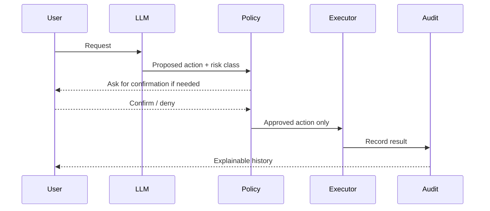
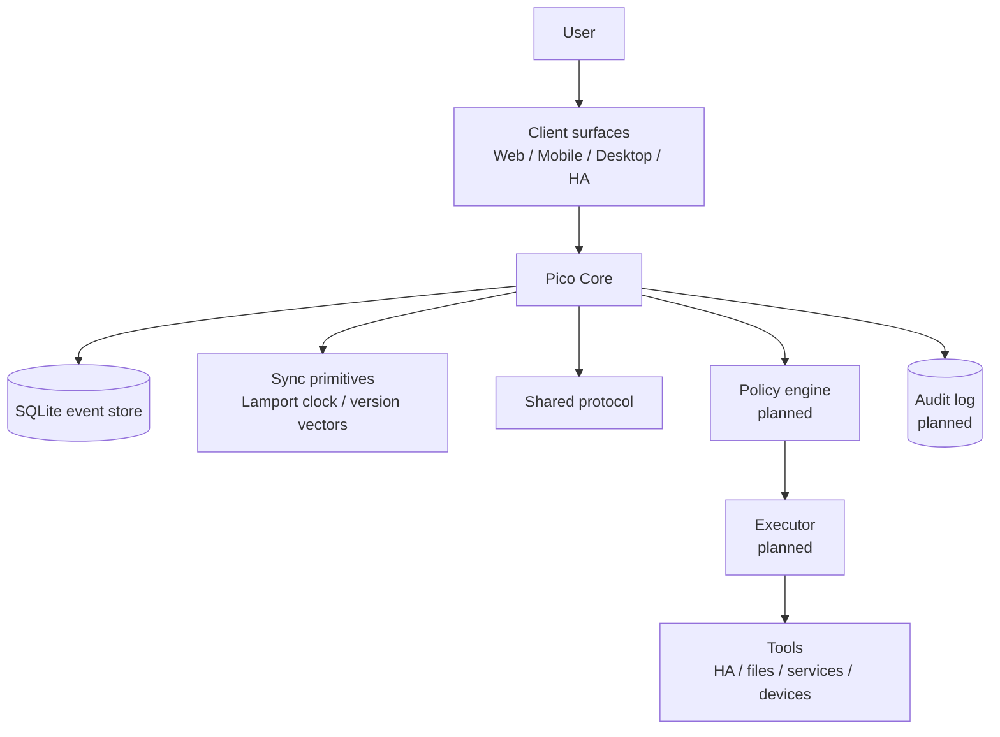
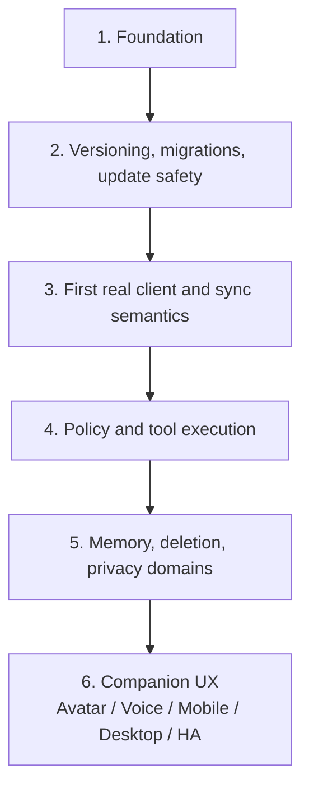

# Pico Technical README


This file is the technical companion to `README.md`.

`README.md` is the non-technical project introduction. `ReadmeTech.md` must always contain all information from `README.md`, plus the technical details needed for contributors, reviewers, operators, and future architecture work.

## Public summary

Pico is a local-first personal AI companion foundation.

The goal is not simply to build another chatbot. Pico is meant to become a sovereign personal agent substrate: an assistant foundation that can run across trusted devices, understand context, interact through text, voice, avatar, and Home Assistant surfaces, and execute approved tools only through clear policy and audit boundaries.

Pico starts deliberately small. The current repository focuses on the foundation: a tested core service, a shared protocol, sync primitives, a release pipeline, and a Home Assistant add-on path.

## Why Pico exists

Most assistant and smart-home systems are controlled by one account, one cloud, or one technical owner. That is convenient, but it can become a control problem in families, partnerships, shared homes, or organisations.

Pico is designed around a different premise:

> Personal AI should help people without taking away their sovereignty.

This means Pico treats identity, ownership, privacy, relationship boundaries, exit rights, and auditability as product features, not as afterthoughts.

## What Pico should become

Pico should eventually be able to:

- run locally where practical
- sync between trusted full clients
- support light clients such as watches or small displays
- work with Home Assistant and other local tools
- remember useful personal context safely
- share presence, activity, location and emergency context only under clear rules
- support shared commitments, reminders and cooperative nudging
- adapt its tone to the user while preserving user control
- explain and audit what it did
- ask for confirmation before risky actions
- keep companion UX separate from execution authority

## What Pico is not

Pico is not intended to become:

- an uncontrolled chatbot with system access
- a cloud-only personal data silo
- a hidden surveillance or control tool
- a global human scoring or reputation system
- a replacement for explicit user confirmation
- a project that invents its own cryptography

## Core authority model

Pico separates suggestion, decision, execution, and audit:

> The assistant may suggest. The policy layer decides. The executor acts only after approval. The audit log records what happened.

Technically, the intended model is:



## Visual identity

Pico's design basis is a small floating digital companion: rounded body, glossy light shell, black face display, expressive glowing eyes, antenna identity light, and a bright chest core.


The avatar communicates state, context, risk, and activity:

| Color | Meaning |
|---|---|
| Blue / cyan | normal, active, available |
| Violet | thinking, analysing, AI reasoning |
| Yellow / amber | warning, uncertainty, confirmation needed |
| Red | blocked, critical, policy stop |
| Green | success, safe completion, positive result |

The full visual design language is documented in `docs/architecture/0013-visual-design-language.md`.

## Current status

Pico is in the foundation phase.

Current version:

```text
0.1.4
```

Implemented or prepared:

- TypeScript monorepo
- Fastify-based Pico Core
- SQLite-backed append-only event store
- Lamport clock and version-vector helpers
- shared protocol package for events, avatar state, and tool payloads
- WebSocket endpoint for event streaming
- CI release gates
- Docker image build
- multi-arch GHCR publishing path
- Home Assistant add-on metadata
- architecture notes under `docs/architecture`

Not production-ready yet:

- authentication and authorization
- policy engine implementation
- tool executor implementation
- encrypted personal data domains
- migration/rollback system
- real companion UI
- voice/avatar runtime

## Architecture overview



## Full clients, light clients and relay

Pico distinguishes three node roles:

| Node type | Role | Data holding | Connectivity |
|---|---|---|---|
| Full Client | full Pico node | full knowledge, local database, sync state, backups where configured | direct, LAN, internet, relay |
| Light Client | interaction surface | minimal cache/session state only | requires Full Client, directly or via relay |
| Relay Server | transport helper | no authority, no Pico memory ownership | forwards encrypted traffic |

Design rule:

> Full Clients own knowledge and backups. Light Clients present and capture interaction. Relay servers transport encrypted messages but do not own Pico identity, memory, or authority.

Details are documented in `docs/architecture/0015-full-clients-light-clients-and-relay.md`.

## Scope discipline

Pico deliberately avoids opening all hard problems at once.

The most dangerous areas are treated as explicit architecture constraints:

- cryptography must use reviewed standards or primitives, not custom protocols
- deleteable memory must not be embedded directly into immutable replicated events
- Lamport clocks provide ordering, not merge semantics
- light clients are interaction surfaces, not knowledge owners
- companion UX must not outrun policy, audit, update safety, and deletion semantics
- trust signals must never become global person scores or safety guarantees

## Deletability and append-only events

Pico uses an append-only event log as a foundation for sync, auditability, replay, and debugging.

That conflicts with future deleteable personal memory if sensitive data is stored directly inside immutable replicated events.

Therefore the design direction is:

> Append-only events record history. Sensitive memory lives behind references, privacy domains, retention policy, and encryption boundaries.

This means sensitive or deleteable payloads should be referenced from events wherever practical instead of embedded directly in the event log.

Details are documented in `docs/architecture/0014-deletability-and-append-only-events.md`.

## Cryptography boundaries

Pico may define sovereignty boundaries, trust relationships, identity concepts, payload domains, and threat models.

Pico must not invent cryptography.

The project will not build custom:

- group encryption protocols
- key agreement protocols
- signature algorithms
- password-based encryption schemes
- recovery cryptography
- MLS-like group state machines

Future encryption work should evaluate established building blocks such as MLS, libsodium, age-style backup encryption, platform keystores, passkeys, or hardware-backed identity where appropriate.

Details are documented in `docs/architecture/0016-cryptography-boundaries-and-non-goals.md`.

## Contextual interaction safety and trust signals

Pico may help users reason about the safety of concrete person-to-person interactions, but it must not become a global reputation system.

Design rule:

> Evaluate the action, not the human as a whole. Evaluate the context, not the reputation. Use trust signals as evidence-labelled hints, never as a free pass.

A remote Pico cannot prove that its owner is trustworthy. It can only provide limited claims, commitments, attestations, or evidence references. The receiving Pico must decide locally, conservatively, and in context.

Hard safety boundaries remain active regardless of positive reputation signals, especially around minors, dependency, isolation, money, physical access, digital access, transport, private spaces, secrecy, urgency, and guardianship boundaries.

Details are documented in `docs/architecture/0017-contextual-interaction-safety-and-trust-signals.md`.

## Presence, context and location sharing

Pico may support sharing presence, activity, ETA, status, approximate location, exact location, live location, emergency state, and similar context between trusted Picos.

This must be consent-based, scoped, visible, revocable, purpose-bound, and as imprecise as possible.

Design rule:

> Pico should share context to support care, coordination and safety — not surveillance, coercion or control.

Relationship alone must not grant permanent access. A partner, family member, organisation, guardian, or family server does not automatically get unlimited location or activity access. Full Clients decide. Light Clients request or display. Relays transport but do not own context.

Details are documented in `docs/architecture/0018-presence-context-and-location-sharing.md`.

## Contextual service and emergency access

Pico may disclose private service, infrastructure, access or emergency context only when role, context, purpose and necessity justify it.

This covers service assistance, emergency infrastructure disclosure and emergency medical disclosure.

Design rule:

> Role + context + purpose + necessity + minimal data + expiry + audit.

For service work, Pico may help authorised people find task-relevant things, such as a water meter, shutoff valve, heating system or service panel. For emergency response, Pico may disclose safety-relevant infrastructure such as the main electrical panel, PV disconnect, battery storage, gas shutoff, water shutoff, hazards or rescue access. For medical emergencies, Pico may disclose a limited source-labelled Emergency Medical Card when the user cannot consent and disclosure is necessary to protect life or health.

Pico must not expose the home, body, memory or personal life as a searchable private database.

Details are documented in `docs/architecture/0020-contextual-service-and-emergency-access.md`.

## Private behaviour, legal risk and harm

Pico must distinguish legal risk, moral harm, personal autonomy and interpersonal trust.

Private behaviour must not become a negative trust signal merely because it is illegal, taboo, unusual or disapproved of in some jurisdictions or social contexts.

Design rule:

> Pico assists. Pico does not police.

Pico should be liberal in private life, strict where real harm, coercion, exploitation, duty risk or danger to others begins. It may warn about legal, health, safety, relationship or practical risks, but must not become a general compliance tool for partners, families, employers, organisations or authorities.

Details are documented in `docs/architecture/0021-private-behaviour-legal-risk-and-harm.md`.

## Shared commitments and cooperative nudging

Pico may support shared commitments such as appointments, reservations, shared chores, project steps, service tasks, care responsibilities and duty tasks.

It should coordinate reminders, confirmations and progress nudges based on importance, external dependency, harm of failure, procrastination risk and participant responsibility.

Design rule:

> Loose plans get gentle reminders. Binding plans require confirmation. Unpleasant duties get small next steps. Critical tasks may escalate. People are not scored; commitments are managed.

Pico must assist cooperation without turning commitments into surveillance, blame, shame or coercive control.

Details are documented in `docs/architecture/0022-shared-commitments-and-cooperative-nudging.md`.

## Adaptive tone, motivation and self-binding

Pico may adapt tone, directness, humour and motivational pressure to the user's preferences and observed effectiveness.

Strong tone is allowed when desired by the user. Real-world consequences require explicit user-owned self-binding policy and must not be imposed by others.

Design rule:

> The tone may be personal. The pressure must be user-owned. Real interventions require policy.

Self-binding may allow bounded actions such as starting focus mode, reducing distractions or controlling a Home Assistant device, but only inside explicit, revocable, audited user-owned policy.

Details are documented in `docs/architecture/0023-adaptive-tone-motivation-and-self-binding.md`.

## Release and update flow


Release rule:

> No green pipeline, no release.

Version bump locations and the release checklist are documented in `docs/release/versioning.md`.

Documentation consistency rules are documented in `docs/release/documentation-consistency.md`.

## Repository structure

```text
.
├── apps
│   ├── core              # Fastify backend service
│   └── web               # first web client placeholder
├── docker
│   └── core.Dockerfile   # Pico Core container image
├── docs
│   ├── architecture      # architecture decision notes and concept docs
│   ├── assets            # README/project assets
│   └── release           # release, versioning and documentation notes
├── packages
│   ├── protocol          # shared event and payload types
│   └── sync              # Lamport clock and version-vector helpers
├── pico_core             # active Home Assistant add-on metadata
├── repository.yaml       # Home Assistant add-on repository metadata
├── README.md             # non-technical project introduction
├── ReadmeTech.md         # full technical project documentation
└── .github/workflows     # CI pipeline
```

## Home Assistant add-on

Pico currently ships a foundation add-on definition under:

```text
pico_core/
```

`pico_core/` is the single source of truth for the Home Assistant add-on metadata.

The add-on uses the prebuilt container image:

```text
ghcr.io/riederch/pico/core
```

Current tag:

```text
0.1.4
```

The add-on exposes Pico Core on port `3100` and defines a watchdog against:

```text
/health
```

Current add-on icon assets:

```text
pico_core/icon.svg
pico_core/logo.svg
```


## Local development

Install dependencies:

```bash
pnpm install
```

Run the full release verification locally:

```bash
pnpm release:verify
```

Start Pico Core:

```bash
pnpm dev:core
```

Health check:

```bash
curl http://localhost:3100/health
```

Create a test event:

```bash
curl -X POST http://localhost:3100/api/events \
  -H 'content-type: application/json' \
  -d '{"deviceId":"desktop-dev","type":"message.created","payload":{"role":"user","text":"Hallo Pico"}}'
```

List events:

```bash
curl http://localhost:3100/api/events
```

## Current API surface

| Endpoint | Purpose |
|---|---|
| `GET /health` | service health check |
| `GET /api/events` | list stored events |
| `POST /api/events` | append an event |
| `WS /ws` | event stream endpoint |

## Binary asset workflow

Large or binary files such as PNG design assets are not edited directly through text-file patch workflows. When such files are needed, they should be prepared as a ZIP archive with the correct repository folder structure. The ZIP can be extracted in the repository root and committed locally.

Expected image asset paths:

```text
docs/assets/pico-design-concept.png
docs/assets/pico-ha-icon.png
docs/assets/pico-readme-hero.png
pico_core/icon.png
```

## Concept documents

The project concept is persisted as architecture notes:

| Document | Topic |
|---|---|
| `0001-foundation.md` | foundation architecture |
| `0002-peer-trust-and-relationships.md` | trust relationships between Pico instances |
| `0003-family-server-and-user-sovereignty.md` | shared server without loss of user sovereignty |
| `0004-parent-child-relationship.md` | guardian/child model |
| `0005-release-and-update-platform.md` | repo, release, and update model |
| `0006-testing-and-release-gates.md` | tests as release blockers |
| `0007-home-assistant-add-on-release.md` | HA add-on update path |
| `0008-product-vision-and-persona.md` | product vision and Pico persona |
| `0009-avatar-and-interaction-model.md` | avatar, voice, and interaction boundaries |
| `0010-tool-policy-and-executor-model.md` | tool policy, executor, and risk classes |
| `0011-privacy-security-and-audit-model.md` | privacy, security, and audit principles |
| `0012-roadmap-foundation-to-companion.md` | roadmap from foundation to companion |
| `0013-visual-design-language.md` | visual identity, avatar states, status colors, and context modes |
| `0014-deletability-and-append-only-events.md` | deleteable memory, tombstones, payload references, and crypto-shredding direction |
| `0015-full-clients-light-clients-and-relay.md` | full clients, light clients, backups, and relay topology |
| `0016-cryptography-boundaries-and-non-goals.md` | cryptography scope, non-goals, and dependency on reviewed primitives |
| `0017-contextual-interaction-safety-and-trust-signals.md` | person-to-person interaction safety, evidence-labelled trust signals, and abuse resistance |
| `0018-presence-context-and-location-sharing.md` | scoped presence, activity, ETA, emergency and location sharing |
| `0020-contextual-service-and-emergency-access.md` | service assistance, emergency infrastructure disclosure and medical emergency disclosure |
| `0021-private-behaviour-legal-risk-and-harm.md` | private behaviour, legal risk, harm, autonomy and anti-authoritarian posture |
| `0022-shared-commitments-and-cooperative-nudging.md` | shared commitments, confirmations, reminders, nudging and anti-procrastination support |
| `0023-adaptive-tone-motivation-and-self-binding.md` | adaptive tone, motivation profiles and user-owned self-binding interventions |

## Roadmap



## Design principles

- Local-first where practical
- User sovereignty over identity and personal data
- Explicit privacy domains
- No unrestricted shell for the LLM
- Policy-gated tool execution
- Confirmation for risky actions
- Append-only event and audit thinking, without embedding sensitive deleteable memory directly in immutable events
- Tests block releases
- Updates must become reversible before real data matters
- Friendly visual companion layer, strict execution layer
- Use reviewed cryptographic primitives; do not invent cryptography
- Full Clients own knowledge and backups; Light Clients are interaction surfaces
- Trust signals are contextual evidence, not global human scores
- Remote Pico self-presentation must never be transformed into trust
- Presence, activity and location sharing must be scoped, visible, revocable, purpose-bound and minimally precise
- Service and emergency disclosures must be role-, context-, purpose- and necessity-bound, minimal, expiring and auditable
- Private behaviour must be evaluated by harm and risk, not by legality, taboo or obedience alone
- Pico assists; Pico does not police
- Shared commitments should manage next actions, not judge people
- Motivational pressure must be user-owned

## Next implementation steps

- Add `GET /api/system/version`
- Add migration tracking
- Add backup-before-migration concept and tests
- Validate the Home Assistant add-on on a real HA installation
- Define first merge semantics for client state before deeper offline editing
- Build the first real web client connected to `/ws`
- Add the first policy-gated read-only tool
