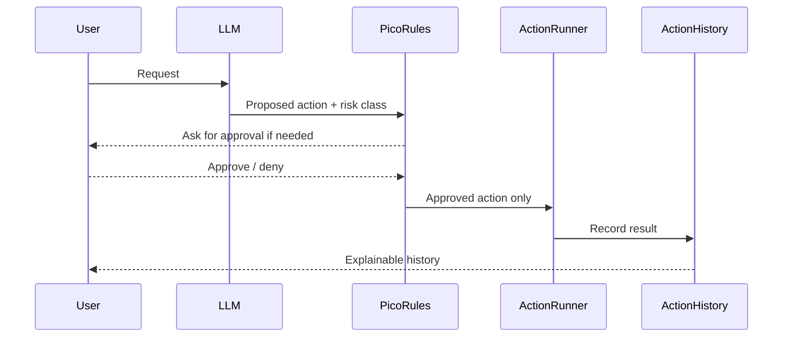
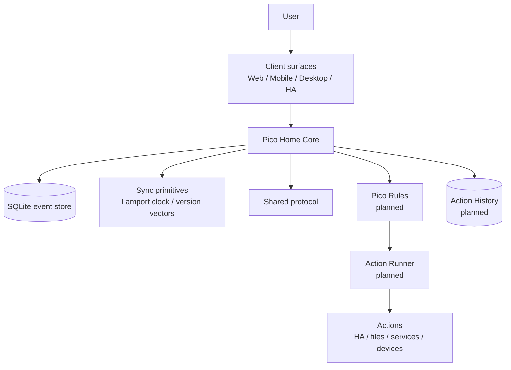

# Pico Technical README


This file is the technical companion to `README.md`.

`README.md` is the non-technical project introduction. `ReadmeTech.md` must always contain all information from `README.md`, plus the technical details needed for contributors, reviewers, operators, and future architecture work.

## Public summary

Pico is a local-first personal AI companion foundation.

The goal is not simply to build another chatbot. Pico is meant to become a sovereign personal agent substrate: an assistant foundation that can run across trusted devices, understand context, interact through text, voice, avatar, and Home Assistant surfaces, and execute approved actions only through clear Pico Rules and Action History boundaries.

Pico starts deliberately small. The current repository focuses on the foundation: a tested core service, a shared protocol, sync primitives, a release pipeline, and a Home Assistant add-on path.

Home Assistant is the first packaging and runtime path, not the only intended platform and not an ownership layer for resident Pico identities or private data.

## License and commercial use

Pico is source-available for private and non-commercial use under the PolyForm Noncommercial License 1.0.0.

Private Pico use, private Pico Home use and private Pico WG use are permitted, including family, household, private shared-home and private non-commercial friend-group use.

Commercial use requires prior written permission from the designated Pico rights holder. This includes paid hosting, managed Pico Home services, Pico Home rental, SaaS operation, paid support, business-internal use and integration into commercial products or services.

Current commercial permission contact:

```text
https://github.com/riederch
```

See `LICENSE`, `NOTICE`, `COMMERCIAL.md`, `LICENSE-FAQ.md`, `TRADEMARK.md` and `CONTRIBUTING.md`.

## Why Pico exists

Most assistant and smart-home systems are controlled by one account, one cloud, or one technical owner. That is convenient, but it can become a control problem in families, partnerships, shared homes, or organisations.

Pico is designed around a different premise:

> Personal AI should help people without taking away their sovereignty.

This means Pico treats identity, ownership, privacy, relationship boundaries, exit rights, and auditability as product features, not as afterthoughts.

## What Pico should become

Pico should eventually be able to:

- run locally where practical
- run Pico Home on multiple host platforms, with Home Assistant as the first packaging path
- sync between trusted Pico Vaults
- support Pico Surfaces such as watches or small displays
- work with Home Assistant and other local tools
- remember useful personal context safely
- share presence, activity, location and emergency context only under clear rules
- support shared commitments, reminders and cooperative nudging
- adapt its tone to the user while preserving user control
- explain and audit what it did
- ask for confirmation before risky actions
- keep companion UX separate from execution authority

## What Pico is not

Pico is not intended to become:

- an uncontrolled chatbot with system access
- a cloud-only personal data silo
- a hidden surveillance or control tool
- a global human scoring or reputation system
- a replacement for explicit user confirmation
- an owner of every resident Pico identity just because it hosts the service
- a project that invents its own cryptography

## Core authority model

Pico separates suggestion, decision, execution, and audit:

> Pico may suggest. Pico Rules decide. The Action Runner acts only after approval. Action History records what happened.

Technically, the intended model is:



## Visual identity

Pico's design basis is a small floating digital companion: rounded body, glossy light shell, black face display, expressive glowing eyes, antenna identity light, and a bright chest core.


The avatar communicates state, context, risk, and activity:

| Color | Meaning |
|---|---|
| Blue / cyan | normal, active, available |
| Violet | thinking, analysing, AI reasoning |
| Yellow / amber | warning, uncertainty, confirmation needed |
| Red | blocked, critical, policy stop |
| Green | success, safe completion, positive result |

The full visual design language is documented in `docs/architecture/0013-visual-design-language.md`.

## Current status

Pico is in the foundation phase.

Current version:

```text
0.1.7
```

Implemented or prepared:

- TypeScript monorepo
- Fastify-based Pico Home Core
- SQLite-backed append-only event store
- Lamport clock and version-vector helpers
- migration runner and backup-before-migration contract
- shared protocol package for events, avatar state, and action payloads
- WebSocket endpoint for event streaming
- foundation diagnostics dashboard
- CI release gates
- Docker image build
- multi-arch GHCR publishing path
- Home Assistant add-on metadata
- architecture notes under `docs/architecture`
- protocol notes under `docs/protocol`

Not production-ready yet:

- authentication and authorization
- Pico Rules implementation
- Action Runner implementation
- encrypted personal data domains
- production migration and rollback orchestration
- real companion UI
- voice/avatar runtime
- multi-resident Pico Home tenancy implementation
- inter-Pico and Pico Home protocol conformance tests

## Architecture overview



## Pico Vaults, Pico Surfaces, Pico Relays and Pico Homes

Pico distinguishes three node roles:

| Node type | Role | Data holding | Connectivity |
|---|---|---|---|
| Pico Vault | full Pico node | full knowledge, local database, sync state, backups where configured | direct, LAN, internet, relay |
| Pico Surface | interaction surface | minimal cache/session state only | requires Pico Vault, directly or via relay |
| Pico Relay | transport helper | no authority, no Pico memory ownership | forwards encrypted traffic |

Pico also distinguishes these node roles from a Pico Home:

| Host type | Role | Authority boundary |
|---|---|---|
| Pico Home | runtime and storage host for Pico Home Core | hosts infrastructure; does not automatically own resident Pico identities, private keys or personal domains |
| Empty Pico Home | freshly installed Pico Home | no resident Pico and no Home Host Pico yet |
| Claimed Pico Home | Pico Home claimed by a Home Host Pico | Home Host Pico can manage residency and future access, not resident private data |

Design rules:

> Pico Vaults own knowledge and backups. Pico Surfaces present and capture interaction. Pico Relays transport encrypted messages but do not own Pico identity, memory, or authority.

> A Pico Home provides infrastructure. Hosting is not ownership.

A freshly installed Pico Home starts empty. A one-time Move-In Code lets the first Pico claim the host. That first Pico becomes the Home Host Pico for this Pico Home. The Home Host Pico may invite additional Home Member Picos and may remove them from future use of this host, but it must not decrypt, impersonate, rewrite or own Home Member Picos.

Details are documented in `docs/architecture/0015-full-clients-light-clients-and-relay.md` and `docs/architecture/0024-server-bootstrap-tenancy-and-eviction.md`.

## Scope discipline

Pico deliberately avoids opening all hard problems at once.

The most dangerous areas are treated as explicit architecture constraints:

- cryptography must use reviewed standards or primitives, not custom protocols
- deleteable memory must not be embedded directly into immutable replicated events
- Pico Homes provide infrastructure, not ownership over resident Pico private domains
- Lamport clocks provide ordering, not merge semantics
- Pico Surfaces are interaction surfaces, not knowledge owners
- companion UX must not outrun Pico Rules, Action History, update safety, and deletion semantics
- Context Signals must never become global person scores or safety guarantees

## Deletability and append-only events

Pico uses an append-only event log as a foundation for sync, auditability, replay, and debugging.

That conflicts with future deleteable personal memory if sensitive data is stored directly inside immutable replicated events.

Therefore the design direction is:

> Append-only events record history. Sensitive memory lives behind references, privacy domains, retention policy, and encryption boundaries.

This means sensitive or deleteable payloads should be referenced from events wherever practical instead of embedded directly in the event log.

Details are documented in `docs/architecture/0014-deletability-and-append-only-events.md`.

## Cryptography boundaries

Pico may define sovereignty boundaries, trust relationships, identity concepts, payload domains, and threat models.

Pico must not invent cryptography.

The project will not build custom:

- group encryption protocols
- key agreement protocols
- signature algorithms
- password-based encryption schemes
- recovery cryptography
- MLS-like group state machines

Future encryption work should evaluate established building blocks such as MLS, libsodium, age-style backup encryption, platform keystores, passkeys, or hardware-backed identity where appropriate.

Details are documented in `docs/architecture/0016-cryptography-boundaries-and-non-goals.md`.
