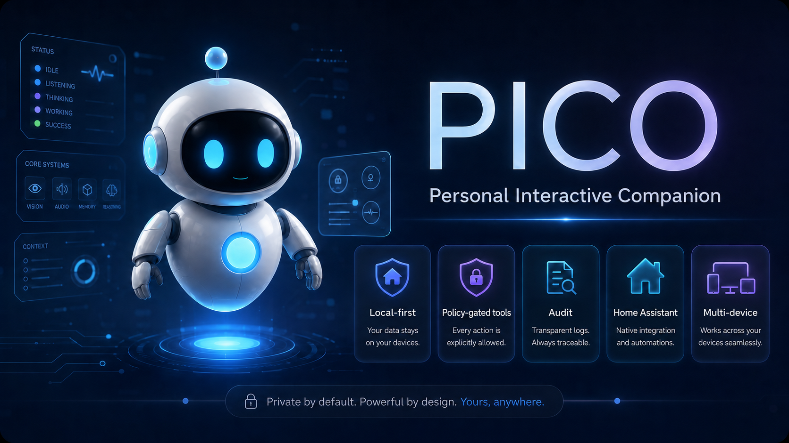
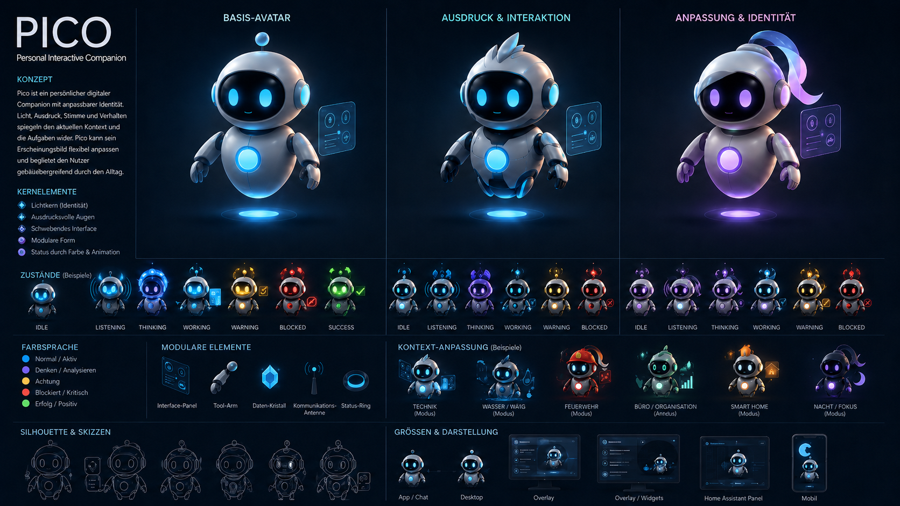

# Pico Core



Pico Core is the Home Assistant add-on foundation for Pico.

Pico is a local-first personal AI companion foundation. The goal is not simply to build another chatbot. Pico is meant to become a personal agent foundation that can run across trusted devices, understand context, interact through text, voice, avatar, and Home Assistant surfaces, and execute approved tools only through clear policy and audit boundaries.

This add-on is the Home Assistant entry point for the current Pico Core service. Home Assistant is the first packaging and runtime path, not the only intended platform and not an ownership layer for resident Pico identities or private data.

For full technical project documentation, see [`../ReadmeTech.md`](../ReadmeTech.md). For add-on installation and operation details, see [`DOCS.md`](DOCS.md).

## Why Pico exists

Many assistant and smart-home systems are controlled by one account, one cloud, or one technical owner. That is convenient, but shared homes, families, partnerships, and organisations need clearer ownership, permissions, exit paths, and auditability.

Pico is designed around a different premise:

> Personal AI should help people without taking away their control over their own data and decisions.

Home Assistant is a useful starting point because it already brings together local devices, sensors, states, events, automations and routines. Pico Core uses that environment as the first add-on packaging and runtime path, while the broader Pico Core host model must also work on other trusted platforms.

## What Pico Core should become

Pico Core should eventually provide the Home Assistant-side foundation for a companion that can:

- run locally where practical
- connect to Home Assistant and other local tools
- understand device, event and household context safely
- store and stream events
- act as a Pico Home endpoint in the Pico Link / Relay network
- support remote reachability through Pico Relay instead of public inbound Home APIs
- support policy-gated tool execution
- support shared commitments, reminders and context-aware nudging
- respect scoped presence, location and emergency context rules
- explain and audit what it did
- ask for confirmation before risky actions
- stay separate from the friendly companion UI layer

## What Pico Core is not

Pico Core is not intended to become:

- an uncontrolled chatbot with system access
- a hidden Home Assistant automation layer
- a cloud-only personal data silo
- a global human scoring or reputation system
- a replacement for explicit user approval
- a production-ready personal data store yet
- an owner of every resident Pico identity just because it hosts the service
- a public internet endpoint for remote access to the Pico Home API
- a relay provider, transport authority or cryptographic identity provider by default
- a project that invents its own cryptography

## Core idea

Pico separates the friendly assistant surface from the authority model:

> The assistant may suggest. The policy layer decides. The executor acts only after approval. The audit log records what happened.

That means Pico may eventually feel helpful and present in Home Assistant, but risky actions still need clear rules, confirmation and traceability.

## Current concept boundaries

Pico's current concept work defines several important boundaries:

- Pico can act as a digital companion and technical twin for a user-chosen subject
- Pico Vaults own knowledge and backups; Pico Surfaces are interaction surfaces
- Pico Core hosts provide infrastructure, but hosting is not ownership over resident Pico identities or private data
- a freshly installed Pico Core host starts unclaimed; a one-time bootstrap claim token / Move-In Code lets the first Pico become the host administrator / Home Host Pico
- the Gastgeber Pico / Home Host Pico may invite or evict residents from that host, but must not decrypt, impersonate, rewrite or own resident Picos
- a future Pico Home Image is an appliance-style installation path for the same host model, not a separate trust model
- Pico Home should be treated as a local endpoint in the Pico Link / Relay network, not as a public inbound API server
- external reachability should use Pico Link transports, primarily Pico Relay, rather than port forwarding into the add-on API
- Pico Relays transport encrypted packets but do not own Pico memory, identity, relationships, actions or authority
- Pico Link is transport-neutral; Meshtastic and future radio standards belong behind transport adapters
- Picos can communicate across different Pico Homes; relationships belong to Picos, not Homes
- capabilities are evaluated above connector protocols; MCP is a tool connection method, not Pico authority
- proactive delegation must remain bounded by user-owned preferences, policy decisions, confirmation and Action History
- Pico identity, device, Home, transport and domain keys are separate roles; Pico must use reviewed primitives and must not invent cryptography
- the current Foundation HTTP API is a trusted local diagnostics and foundation interface, not a public remote-access API
- trust signals are contextual evidence, not global person scores
- presence and location sharing must be scoped, visible, revocable and minimally precise
- service and emergency disclosures must be role-, context-, purpose- and necessity-bound
- personal context should remain private unless a clear purpose and policy allow otherwise
- shared commitments should manage next actions, not judge people
- motivational pressure must be user-owned

## Current status

Pico Core is in the foundation phase.

Current version:

```text
0.1.7
```

The current foundation add-on provides:

- local HTTP API
- realtime WebSocket endpoint
- SQLite-backed event storage
- foundation diagnostics dashboard
- health check endpoint for add-on monitoring
- first packaging and update path for later Pico functions

Pico Core is **not production-ready** yet. Authentication, authorization, policy execution, encrypted personal data domains, relay transport, Pico Link transport security, migration safety, backup/rollback behaviour and companion clients still need to be built.

The current Foundation HTTP and WebSocket API is local diagnostics only. Direct Foundation HTTP API and realtime access can be protected with the temporary `PICO_FOUNDATION_TOKEN` and short-lived WebSocket tickets, but this is not production authentication or authorization. Do not expose port `3100` outside a trusted local development or add-on boundary. Home Assistant ingress metadata, ingress-prefix-aware dashboard URLs, the optional add-on `pico_foundation_token` bridge and the `PICO_FOUNDATION_ACCESS_MODE` startup gate are implemented as foundation hardening, but real HA install validation remains open. Current `deviceId` values are client-supplied metadata, and `signature` values are stored as unverified metadata rather than cryptographic proof.

## Visual direction

Pico's visual direction is a small floating digital companion with a light shell, dark face display, glowing eyes, an antenna identity light and a bright chest core.



The avatar communicates state and risk. For example:

| Color | Meaning |
|---|---|
| Blue / cyan | normal and available |
| Violet | thinking or analysing |
| Yellow / amber | warning or confirmation needed |
| Red | blocked or critical |
| Green | success |

## Home Assistant entry points

| Entry point | Purpose |
|---|---|
| Home Assistant ingress panel | Preferred add-on browser path for the foundation diagnostics dashboard, pending real HA install validation |
| Internal port `3100` | Pico Core local foundation HTTP API and WebSocket endpoint used by ingress and watchdog |
| `/` | foundation diagnostics dashboard |
| `/health` | add-on health check |
| `/api/events` | event list and event creation |
| `/api/events/tail` | latest foundation events for diagnostics dashboard use |
| `/ws` | realtime event stream |

`/api/events/tail` is diagnostics-only. It is not a replica sync protocol and does not provide durable sync cursors.

Port `3100` is no longer published to the Home Assistant host by default. It remains the internal service port used by ingress and the watchdog. Future remote reachability should use Pico Link transports and Pico Relay instead of exposing the add-on API to the internet.

ADR 0038 defines the staged hardening direction: Home Assistant ingress should become the preferred protected browser path for the add-on, while a temporary Foundation token can protect direct standalone/container access until real Pico identity, membership and pairing exist. ADR 0039 defines the direct-access WebSocket ticket boundary for token-protected deployments. ADR 0040 defines the concrete ingress metadata, ingress-prefix URL requirement, add-on token option and packaging-default direction. ADR 0041 defines the explicit access-mode gate. The current add-on metadata includes ingress, a working `pico_foundation_token` option bridge, `PICO_FOUNDATION_ACCESS_MODE=ha-ingress` entrypoint defaulting and a closed direct host port by default, but real Home Assistant validation remains follow-up work.

Persistent data is stored in the Home Assistant add-on data directory:

```text
/data/pico.sqlite
```

## Roadmap in plain language

1. Build a safe technical foundation.
2. Make updates and migrations safe before real user data matters.
3. Build the first usable client.
4. Define identity, transport, relay, encryption, lifecycle and canonicalization boundaries before real remote communication; after that, optionally build a small non-blocking walking-skeleton tech demo.
5. Add policy-gated tool execution.
6. Add memory only after deletion and privacy-domain semantics are clear.
7. Add richer companion UX after the control and audit layers are solid.

## Documentation map

- [`DOCS.md`](DOCS.md) - Home Assistant add-on installation and operation details
- [`CHANGELOG.md`](CHANGELOG.md) - add-on-specific changelog
- [`../README.md`](../README.md) - non-technical project overview
- [`../ReadmeTech.md`](../ReadmeTech.md) - full technical project documentation
- [`../docs/architecture`](../docs/architecture) - architecture decisions and concept notes
- [`../docs/architecture/0027-dedicated-pico-home-image-and-first-boot-setup.md`](../docs/architecture/0027-dedicated-pico-home-image-and-first-boot-setup.md) - dedicated Pico Home Image and first-boot setup concept
- [`../docs/architecture/0028-pico-link-transport-facade-and-relay-network.md`](../docs/architecture/0028-pico-link-transport-facade-and-relay-network.md) - Pico Link transport facade, relay network and low-bandwidth transport concept
- [`../docs/architecture/0029-identity-device-home-keys-and-e2e-boundaries.md`](../docs/architecture/0029-identity-device-home-keys-and-e2e-boundaries.md) - Pico identity, device, Home, transport and domain key boundaries
- [`../docs/architecture/0030-foundation-api-exposure-and-local-trust-boundary.md`](../docs/architecture/0030-foundation-api-exposure-and-local-trust-boundary.md) - current Foundation API exposure and local trust boundary
- [`../docs/architecture/0031-pico-link-identity-relay-and-domain-threat-model.md`](../docs/architecture/0031-pico-link-identity-relay-and-domain-threat-model.md) - Pico Link identity, relay metadata and protected-domain threat model
- [`../docs/architecture/0032-pico-link-envelope-and-credential-schema-direction.md`](../docs/architecture/0032-pico-link-envelope-and-credential-schema-direction.md) - Pico Link envelope, credential and key-envelope schema direction
- [`../docs/architecture/0033-key-lifecycle-rotation-revocation-and-recovery.md`](../docs/architecture/0033-key-lifecycle-rotation-revocation-and-recovery.md) - key lifecycle, rotation, revocation and recovery boundaries
- [`../docs/architecture/0034-canonicalization-signature-inputs-and-test-vectors.md`](../docs/architecture/0034-canonicalization-signature-inputs-and-test-vectors.md) - canonicalization, signature-input and test-vector boundaries
- [`../docs/architecture/0035-pico-as-digital-companion-and-twin-model.md`](../docs/architecture/0035-pico-as-digital-companion-and-twin-model.md) - Pico as digital companion and technical twin model
- [`../docs/architecture/0036-capabilities-connectors-and-mcp-boundary.md`](../docs/architecture/0036-capabilities-connectors-and-mcp-boundary.md) - capabilities, connectors and MCP boundary
- [`../docs/architecture/0037-proactive-companion-delegation-and-procurement.md`](../docs/architecture/0037-proactive-companion-delegation-and-procurement.md) - proactive delegation and procurement reference case
- [`../docs/architecture/0038-foundation-local-access-hardening-and-ingress-boundary.md`](../docs/architecture/0038-foundation-local-access-hardening-and-ingress-boundary.md) - staged Foundation access hardening, Home Assistant ingress and temporary direct-access token boundary
- [`../docs/architecture/0039-foundation-websocket-ticket-boundary.md`](../docs/architecture/0039-foundation-websocket-ticket-boundary.md) - direct-access Foundation WebSocket ticket boundary
- [`../docs/architecture/0040-foundation-home-assistant-ingress-and-addon-token-options.md`](../docs/architecture/0040-foundation-home-assistant-ingress-and-addon-token-options.md) - concrete Home Assistant ingress metadata, add-on token option and packaging-default direction
- [`../docs/architecture/0041-foundation-access-modes-and-direct-port-gate.md`](../docs/architecture/0041-foundation-access-modes-and-direct-port-gate.md) - explicit Foundation access modes and direct-port gate
- [`../docs/architecture/0042-pico-link-draft-schema-and-fixture-gate.md`](../docs/architecture/0042-pico-link-draft-schema-and-fixture-gate.md) - draft-only Pico Link schema and fixture staging gate
- [`../docs/architecture/0043-pico-link-draft-packet-envelope-preflight.md`](../docs/architecture/0043-pico-link-draft-packet-envelope-preflight.md) - draft-only Pico Link packet-envelope preflight shape
- [`../docs/architecture/0044-pico-link-draft-protected-payload-placeholder.md`](../docs/architecture/0044-pico-link-draft-protected-payload-placeholder.md) - draft-only Pico Link protected-payload placeholder boundary
- [`../docs/architecture/0045-pico-home-link-draft-membership-credential-placeholder.md`](../docs/architecture/0045-pico-home-link-draft-membership-credential-placeholder.md) - draft-only Pico Home Link membership-credential placeholder boundary
- [`../docs/architecture/0046-draft-compatibility-claim-placeholder.md`](../docs/architecture/0046-draft-compatibility-claim-placeholder.md) - draft-only compatibility-claim placeholder boundary
- [`../docs/architecture/0047-draft-canonicalization-rejection-placeholder.md`](../docs/architecture/0047-draft-canonicalization-rejection-placeholder.md) - draft-only canonicalization rejection placeholder boundary
- [`../docs/architecture/0048-model-capability-delegation-and-remote-inference-boundary.md`](../docs/architecture/0048-model-capability-delegation-and-remote-inference-boundary.md) - delegated model capability and remote inference authority boundary
- [`../docs/architecture/0049-model-provider-registry-and-job-envelope.md`](../docs/architecture/0049-model-provider-registry-and-job-envelope.md) - model provider registry and scoped job-envelope direction
- [`../docs/architecture/0050-model-delegation-draft-fixture-gate.md`](../docs/architecture/0050-model-delegation-draft-fixture-gate.md) - draft-only model delegation fixture staging gate
- [`../docs/architecture/0051-pico-link-draft-device-credential-placeholder.md`](../docs/architecture/0051-pico-link-draft-device-credential-placeholder.md) - draft-only Pico Link device credential placeholder boundary
- [`../docs/architecture/0052-pico-link-draft-lost-device-revocation-placeholder.md`](../docs/architecture/0052-pico-link-draft-lost-device-revocation-placeholder.md) - draft-only Pico Link lost-device revocation placeholder boundary
- [`../docs/architecture/0053-pico-link-draft-revocation-registry-placeholder.md`](../docs/architecture/0053-pico-link-draft-revocation-registry-placeholder.md) - draft-only Pico Link revocation registry placeholder boundary
- [`../docs/architecture/0054-pico-link-draft-key-envelope-rotation-placeholder.md`](../docs/architecture/0054-pico-link-draft-key-envelope-rotation-placeholder.md) - draft-only Pico Link key-envelope rotation placeholder boundary
- [`../docs/architecture/0055-pico-link-draft-identity-key-placeholder.md`](../docs/architecture/0055-pico-link-draft-identity-key-placeholder.md) - draft-only Pico Link identity-key placeholder boundary
- [`../docs/release/versioning.md`](../docs/release/versioning.md) - release/versioning checklist
- [`../docs/release/documentation-consistency.md`](../docs/release/documentation-consistency.md) - README and concept consistency rules
- [`../docs/protocol/public-surfaces.md`](../docs/protocol/public-surfaces.md) - public compatibility surfaces
- [`../docs/protocol/compatibility-levels.md`](../docs/protocol/compatibility-levels.md) - compatibility level definitions
- [`../docs/protocol/conformance-fixtures.md`](../docs/protocol/conformance-fixtures.md) - non-cryptographic conformance fixture layout and Foundation event/realtime fixture seed

## Design principles

- Local-first where practical
- User control over identity and personal data
- Explicit privacy domains
- Policy-gated tool execution
- Confirmation for risky actions
- Auditability instead of hidden automation
- Friendly companion layer, strict execution layer
- Pico can be a digital companion and technical twin of a user-chosen subject
- Pico Vaults own knowledge and backups; Pico Surfaces are interaction surfaces
- Core hosts provide infrastructure; hosting is not ownership
- Pico Home is a local endpoint in the Pico Link / Relay network, not a public inbound API server
- Pico Relay provides transport, not authority
- Pico Link remains transport-neutral; specific transports belong behind adapters
- Capabilities are evaluated above connector protocols; MCP is not an authority layer
- Proactive delegation must remain bounded by user-owned preferences, policy decisions, confirmation and Action History
- Meshtastic and future radio transports are optional low-bandwidth adapters, not Pico identity or authority layers
- The current Foundation API remains local/trusted until auth, membership, policy and Pico Link boundaries exist
- A Gastgeber Pico / Home Host Pico may manage residency on a host, not resident private data
- Home Assistant integration must not bypass Pico's policy and audit model
- Presence and location sharing must be scoped, visible, revocable and minimally precise
- Shared commitments should manage next actions, not judge people
- Motivational pressure must be user-owned
- Use reviewed cryptographic primitives; do not invent cryptography
